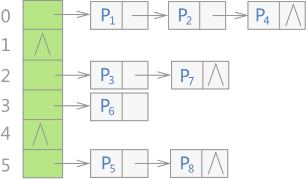
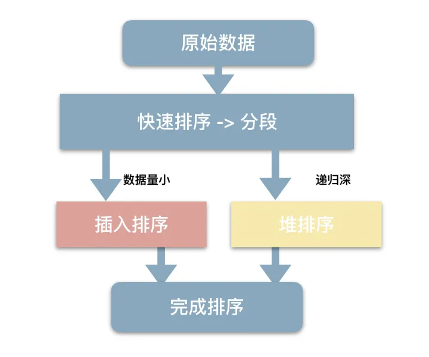

# C/C++理论

## C++突击面试：https://blog.csdn.net/mao834099514/article/details/124639915

## C 与 C++ 的区别(面向对象的特点)

1.  C++与C（**面向过程**）相比，有**面向对象**的特点，可以构建抽象的数据类型
2.  具体到细节的话：
    1.  **不同的关键字数量**：C语言有32个关键字。C++有63个关键字；
    2.  **不同的文件保存后缀**：.c和.cpp
    3.  **不同的默认返回值**：C未指定时默认返回int类型，C++中，若函数没有返回值则必须指定为void。
    4.  **参数列表**：在C没有指定参数列表时默认可以**接收任意多个参数**。C++中没有参数列表的函数默认为**不接收任何参数。**
    5.  C语言不支持**缺省参数**和**函数重载**
    6.  **const**：**C**语言中被const修饰的变量叫做**常变量**无法当作数组下标。在**C++**中const修饰的变量是真正的**常量**可以当作数组下标使用，
    7.  **malloc,free && new,delete**：malloc()和free()是C语言中动态申请内存和释放内存的标准库中的函数。new和delete是C++运算符、关键字。new和delete底层其实还是调用了malloc和free。
    8.  **作用域**：C语言中作用域只有两个：**局部，全局**。C++中则是有：**局部作用域，类作用域，名字空间作用域**三种。

## 什么是缺省参数

**缺省参数**是声明或定义函数时为**函数的参数指定一个默认值**。在调用该函数时，如果没有指定实参则采用该默认值，否则使用指定的参。

## 什么是函数重载

函数重载是函数的一种特殊情况，指在同一作用域中，声明几个**功能类似的同名函数**，这些同名函数的**形参列表（参数个数、类型、顺序）必须不同**，返回值类型可以相同也可以不同。

## C++ 与 Python的区别：C++为编译性编程语言，Python 则为解释性编程语言。

**编译型语言**在程序执行之前，有一个单独的编译过程，将程序翻译成机器语言，以后执行这个程序的时候，就无需再进行编译，直接执行可执行文件即可。

**解释型语言**是指使用专门的解释器对源程序进行逐行解释成特定平台的机器码并立即执行的语言。执行解释型语言的程序都需要进行一次编译，但跨平台比较容易

2、**执行效率**不同：C++执行效率高 ，Python执行效率低，C++的运行效率要比Python快

3、**开发效率**不同：C++开发效率低 ，编程难度大；Python开发效率高，编程难度小

4、**内存管理机制**不同：Python 有自动内存管理机制，不允许直接进行内存处理操作。但在C++所有内存管理操作都需要自行处理。

5、**函数库**使用方法不同：C++引用头文件需要告知预处理器这个文件的内容；Python可以使用函数直接引用。

6、**便携程度**不同：C++ 是不可移植的，即我们需要在每个不同的平台上重新编译代码Python 是可移植的。它也是跨平台的，我们可以在任何平台上执行程序。

9、**变量范围**不同：C++ 的代码由使用大括号 ({}) 和循环的块分隔。变量的范围仅限于由 {} 划分的这些块和循环。Python 中使用的变量范围不限于块或循环。即使在花括号之外也可以访问变量。

## 判断struct的字节数：sizeof(struct)的计算规则

计算 sizeof(a) 是多少？

有两个原则：

1）**各成员变量存放的起始地址相对于结构的起始地址的偏移量必须为该变量的类型所占用的字节数的倍数** 即当 A中的a占用了5个字节后，b需要占用四个字节，此时如果b直接放在a后，则b的起始地址是5，不是sizeof(int)的整数倍，所以 需要在a后面补充3个空字节，使得b的起始地址为8. 当放完b后，总空间为5+3+4 = 12. 接着放c，此时为 12 + 2 = 14.

2）为了**确保结构的大小为该结构中占用最大空间的类型所占用的字节数的倍数， 所以在为最后一个成员变量申请空间后，还会根据需要自动填充空缺的字节。** 这是说A中占用最大空间的类型，就是int型了，占用了4个字节，那么规定A占用的空间必须是4的整数倍。本来计算出来占用的空间为14， 不是4的整数倍，因此需要在最后补充2个字节。最终导致A占用的空间为16个字节。

## 32位机数据类型对应字节数：

char:1字节；short:2字节； int:4字节； **long:4字节**； long long:8字节；float:4字节；

long double:8字节；

## 64位机数据类型对应字节数：

char: 1字节；short: 2字节； int: 4字节；**long: 8字节**； long long: 8字节； float: 4字节；double: 8字节； long double: 16字节；

指针：4字节；long long：windows8字节，Linux系统4字节

[【C++】计算struct结构体占用的长度](https://blog.csdn.net/nisxiya/article/details/22456283?utm_source=copy)

## 关键字：

### inline

用于定义**内联函数**，在编译时，**编译器会把该函数的代码副本放置在每个调用该函数的地方**。

对内联函数进行任何**修改，都需要重新编译函数的所有客户端**，**在类定义中的定义的函数都是内联函数**，即使没有使用 inline 说明符。

### auto

auto C++ 11中使用它来做**自动类型推导**，编译器会在编译期间自动推导出变量的类型

#### --使用限制：

-   **使用 auto 的时候必须对变量进行初始化**
-   **auto 不能在函数的参数中使用。**
-   **auto 不能作用于类的非静态成员变量（也就是没有 static 关键字修饰的成员变量）中。**
-   **auto 关键字不能定义数组**

### decltype

与auto相同，用来在编译时期进行自动类型推导，但decltype根据指定的表达式推导变量类型，与等号右侧的变量值类型无关

### volatile

volatile 关键字是一种**类型修饰符**，用它**声明的类型变量表示可以被某些编译器未知的因素更改**

### static 作用

第一个作用是**限定作用域**；第二个作用是**保持变量内容持久化**；

c语言中static的用法：

**1、全局静态变量**：在全局变量前加上关键字static，全局变量就定义成一个全局静态变量。 static int temp；

**内存中的位置**：静态存储区，在整个程序运行期间一直存在。

**初始化**：未经初始化的全局静态变量会被自动初始化为0（自动对象的值是任意的，除非他被显式初始化）；

**作用域**：全局静态变量在声明他的文件之外是不可见的，准确地说是**从定义之处开始，到文件结尾。**

**2、局部静态变量**： 在局部变量之前加上关键字static，局部变量就成为一个局部静态变量。

**内存中的位置**：静态存储区

**初始化**：未经初始化的全局静态变量会被自动初始化为0（自动对象的值是任意的，除非他被显式初始化）；

**作用域**：作用域仍为局部作用域，当定义它的函数或者语句块结束的时候，作用域结束。**但是当局部静态变量离开作用域后，并没有销毁，而是仍然驻留在内存当中，只不过我们不能再对它进行访问，直到该函数再次被调用，并且值不变；**

**3、静态函数**：

在函数返回类型前加关键字static，函数就定义成静态函数。函数的定义和生命在默认情况下都是extern的，但**静态函数只是在声明他的文件当中可见，不能被其他文件所用**；

### Const （常量）作用

**限定所修饰的东西不可以被改变（只读）**，可用来修饰变量，参数，返回值,甚至函数体。const可以提高程序的健壮性，减少程序出错

（1）const char p //限定变量p为只读。这样如p=2这样的赋值操作就是错误的。

（2）const char \*p //p为一个指向char类型的指针，const只限定p指向的对象为只读。这样，p=&a或 p++等操作都是合法的，但如\*p=4这样的操作就错了，因为企图改写这个已经被限定为只读属性的对象。 （const 限定\*p，即限定p指向的内容）

（3）char \*const p 限定此指针为只读，这样p=&a或 p++等操作都是不合法的。而\*p=3这样的操作合法，因为并没有限定其最终对象为只读。 （const直接与p结合，因此这里只限定了指针本身p，但内容可以修改 ）

（4）const char \*const p 两者皆限定为只读，不能改写。 （结合方向：const char \*（const p））

有了以上的对比，再来看二级指针问题：

（1）const char \*\*p p为一个指向指针的指针，const限定其最终对象为只读，显然这最终对象也是为char类型的变量。故像\*\*p=3这样的赋值是错误的，而像\*p=？ p++这样的操作合法。

（2）const char \* const \*p 限定最终对象和 p指向的指针为只读。这样 \*p=?的操作也是错的。

（3）const char \* const \* const p 全部限定为只读，都不可以改写。

### extern "C"的作用

extern "C"的主要作用就是为了能够正确实现C++代码调用其他C语言代码。加上**extern "C"后，会指示编译器这部分代码按C语言（而不是C++）的方式进行编译**

## 多态(面向对象的核心)

**虚函数用于实现运行时的多态**

当类之间存在层次结构，并且**类之间是通过继承关联（静态链接：实现传入不同类型的参数调用不同子类中对应的函数）**时，在基类的函数前加上**virtual关键字（动态；链接）**，在派生类中重写该函数，运行时将会根据对象的实际类型来调用相应的函数。如果对象类型是派生类，就调用派生类的函数；如果对象类型是基类，就调用基类的函数

## 虚函数定义

在基类中使用关键字 virtual 声明的函数。**纯虚函数：在基类中仅声明，在派生类中具体定义**。纯虚函数是虚函数再加上 = 0； **抽象类**是指包括至少一个纯虚函数的类。

存在**虚函数的类**都有一个**一维的虚函数表叫做虚表**，类的对象有一个指向虚表开始的虚指针。

**虚函数所在的类**绑定**唯一虚表，类对象绑定**唯一的**虚指针**

## C++虚函数的实现机制

this -\> vptr（**虚表指针**） -\> vtable（**虚函数表**） -\>virtual function（**虚函数**）

**当调用一个虚函数时，首先通过对象内存中的虚表指针vptr找到虚函数表vtbl，接着通过vtbl找到对应虚函数的实现区域并进行调用。其中被执行的代码必须和调用函数的对象的动态类型相一致。**

一般继承时，子类的虚函数表中先将父类虚函数放在前，再放自己的虚函数指针。

如果子类覆盖了父类的虚函数，将被放到了虚表中**原来父类虚函数**的位置。

在多继承的情况下，每个父类都有自己的虚表，子类的成员函数被放到了第一个父类的表中。也就是说当类在多重继承中时，其**实例对象的内存结构并不只记录一个虚函数表指针。基类中有几个存在虚函数，则子类就会保存几个虚函数表指针**

## 多态的虚函数（父类和子类）返回值类型可以不一样吗？什么情况下，返回值类型不一样？

子类**重载虚函数时要满足三同**：返回值类型、函数名、参数列表完全相同

特殊情况：

1.  **协变——返回值类型不同**：父类的虚函数**返回父类对象的指针或者引用**，子类虚函数**返回子类对象的指针或者引用**。
2.  **析构函数重写——父类与子类析构函数名字不同**

## 为何static函数不能为virtual

虚函数的调用关系：this -\> vptr（**虚表指针**） -\> vtable（**虚函数表**） -\>virtual function（**虚函数**），对于**静态成员函数，它没有this指针，所以无法访问vptr**.

## 析构函数

删除对象时调用的函数，析构函数的名称与类的名称是完全相同的，只是在前面加了个波浪号（\~）作为前缀，它不会返回任何值，也不能带有任何参数。

## 虚析构函数的作用

总的来说虚析构函数是为了避免内存泄露，而且是**当子类中会有指针成员变量时**才会使用得到的。也就说**虚析构函数使得在删除指向子类对象的基类指针时可以调用子类的析构函数达到释放子类中堆内存的目的，而防止内存泄露**的.

**（1）如果父类的析构函数不加virtual关键字**

当父类的析构函数不声明成虚析构函数的时候，当子类继承父类，**父类的指针指向子类时，delete掉父类的指针**，只调动父类的析构函数，而不调动子类的析构函数。

**（2）如果父类的析构函数加virtual关键字**

当父类的析构函数声明成虚析构函数的时候，当子类继承父类，父类的指针指向子类时，delete掉父类的指针，先调动子类的析构函数，再调动父类的析构函数。

## virtual函数能不能用在构造函数中？

**不能，1. 从vptr角度解释：访问虚函数表需要用到对象内存空间中的虚表指针，但此时对象需要通过构造函数初始化才可以生成，所以构造函数不能是虚函数**（如果构造函数是虚函数，那么调用构造函数就需要去找vptr，但此时vptr还没有初始化！）

2\. 从多态角度解释：虚函数主要是实现多态，在运行时才可以明确调用对象，根据传入的对象类型来调用函数，例如通过父类的指针或者引用来调用它的时候可以变成调用子类的那个成员函数。而构造函数是在创建对象时自己主动调用的，不可能通过父类的指针或者引用去调用。那使用虚函数也没有实际意义。

在调用构造函数时还不能确定对象的真实类型（由于子类会调父类的构造函数）；并且构造函数的作用是提供初始化，在对象生命期仅仅运行一次，不是对象的动态行为，没有必要成为虚函数。

## 继承

不同类型的继承时，遵循以下几个规则：

**公有继承（public）**：当一个类派生自**公有基类**时，基类的公有成员也是派生类的**公有成员**，基类的保护成员也是派生类的**保护成员**，基类的私有成员不能直接被派生类访问，但是可以通过调用基类的公有和保护成员来访问。

**保护继承（protected）：** 当一个类派生自**保护基类**时，基类的公有和保护成员将成为派生类的**保护成员**。

**私有继承（private）：**当一个类派生自**私有基类**时，基类的公有和保护成员将成为派生类的**私有成员**。

**多继承：**C++允许一个类继承自多个类

## 多任务处理

多任务处理允许让电脑同时运行两个或两个以上的程序。两种类型的多任务处理：基于**进程**和基于**线程**。

基于**进程**的多任务处理是**程序**的并发执行。

基于**线程**的多任务处理是**同一程序的片段**的并发执行。

## 线程同步的定义

线程同步是指**线程并行**，但线程之间所**具有的一种制约关系，一个线程的执行依赖另一个线程的消息**，当它没有得到另一个线程的消息时应等待，直到消息到达时才被唤醒。例如：两个线程A和B在运行过程中协同步调，**按预定的先后次序**运行，比如 A 任务的运行依赖于 B 任务产生的数据。

## 线程互斥的定义

线程互斥是指对于共享的操作系统资源，在**各线程访问时具有排它性。**任何时刻**最多只允许有限的线程去使用某一共享资源**，其它要使用该资源的线程必须等待，直到占用资源者释放该资源。例如：两个线程A和B在运行过程中共享同一变量，但为了保持变量的一致性，如果A占有了该资源则B需要等待A释放才行，如果B占有了该资源需要等待B释放才行。

## 多线程的同步问题

多线程程序包含可以同时运行的两个或多个部分。这样的程序中的每个部分称为一个线程，每个线程定义了一个单独的执行路径。

## 为什么需要设置线程同步：

**（为解决对同一资源的访问冲突问题）**多个线程之间会共享同一资源。当多个线程去访问同一资源时，如果不加以干预，可能会引起冲突，且无法保证访问的先后顺序，所以**为保证线程能了解其他线程任务处理结束后的处理结果而采取的保护措施即为线程同步**

## 线程同步的实现方式：互斥锁，条件变量，读写锁，信号量

1.  **互斥锁：通过加锁的方式控制多个线程对共享资源的访问，**互斥锁有两个状态，上锁与解锁(lock和unlock)。lock互斥锁是一个原子操作，这说明**在同一时刻只能有一个线程锁住互斥锁**，不会出现同时上锁的情况，同时，互斥锁具有唯一性，**一旦上锁，其他线程不能够再将其锁住**。当一个互斥锁被锁住时，**其他希望锁住该锁的线程将被挂起，当前互斥锁解锁后按顺序唤醒**再次抢占成功。**缺点：**某个线程正在等待共享数据内某个条件出现，可可能需要重复对数据对象加锁和解锁（轮询），但是这样轮询非常耗费时间和资源，而且效率非常低
2.  **条件变量：当线程在等待满足某些条件时使线程进入睡眠状态（线程阻塞），等待另一个线程发送条件满足信号就唤醒因等待满足特定条件而睡眠的线程**
3.  **读写锁：可以多个线程同时读，但是不能多个线程同时写**，最适用于对数据结构的读操作读操作次数多余写操作次数的场合！**锁处于读模式时可以线程共享，而锁处于写模式时只能独占**，所以读写锁又叫做共享-独占锁

**读写锁有两种策略：强读同步和强写同步**

在**强读同步**中，总是给读者更高的优先权，只要写者没有进行写操作，读者就可以获得访问权限

在**强写同步**中，总是给写者更高的优先权，读者只能等到所有正在等待或者执行的写者完成后才能进行读

1.  **信号量**：信号量（sem）和互斥锁的区别：互斥锁只允许一个线程进入临界区，而信号量允许多个线程进入临界区

## 左值和右值

**左值**指既能够出现在等号左边，也能出现在等号右边的变量，**是可寻址的变量，有持久性**；

**右值**则是只能出现在等号右边的变量。一般是不**可寻址的常量**，或在表达式求值过程中创建的**无名临时对象**，短暂性的。

**左值和右值主要的区别之一是左值可以被修改，而右值不能。（可寻址和不可寻址）**

## C++的设计模式

**工厂模式**：建一个工厂类，**外部只需要向工厂类这个接口传递产品参数，工厂类在内部完成对应产品对象的创建**

**策略模式**：以**抽象的策略类**为接口，所有策略算法都**单独定义为抽象策略类的子类**，定义一个环境角色类接受策略标签，然后调用封装好的对应子类策略对象

**适配器模式**：继承自某个已有的类，对该类实现指定的功能拓展，如栈和队列类继承底层为双端队列 + 限制其元素的进出方式

**单例模式**：一个类只能有一个实例化对象；且只能自己创建，并向外部提供访问接口

**懒汉单例模式：不使用就不实例化。**在第一次用到类实例的时候才会去实例化一个对象。在访问量较小，甚至可能不会去访问的情况下，采用懒汉实现，这是**以时间换空间**

**饿汉单例模式：在单例类定义的时候就进行实例化。**在访问量比较大，或者可能访问的线程比较多时，采用饿汉实现，可以实现更好的性能。这是**以空间换时间。**

**原型模式：**在**子类中实现拷贝构造函数**，实现**利用抽象父类对象快速构建子类对象，通常用于需要复制对象的情况**

**模板模式：**当**多个类有相同的方法，并且逻辑相同，只是细节上有差异**时，可以考虑使用模板模式。具体的实现上可以**将相同的核心算法设计为模板方法，具体的实现细节有子类实现**。

建造者模式：

**外观模型**：子系统将所有复杂功能进行封装，向外提供一个统一的接口用于调用对应的功能

组合模式: **将对象组合成树形结构以表示“部分-整体”的层次结构**，组合模式使得客户端对**单个对象和组合对象的使用具有一致性**。

**代理模式:** 一个是真正的你要访问的对象(目标类)，一个是代理对象, 真正对象与代理对象实现同一个接口,先访问代理\*，然后代理访问目标对象

**享元模式**：将大量对象包含的信息分为两个部分：内部状态（用于和其他对象共享，不随环境变化）和外部状态（不可共享，随环境变化），如果有相同的业务请求，直接返回内存中已有的对象，避免重新创建。

**桥接模式**：构造抽象类和实现类，实现类继承自抽象类，eg手机（抽象）-\>android、ios（具体实现）

**装饰模式**：通过装饰函数包裹对象，给对象添加一些额外的功能

**备忘录模式**：在不破坏封装性的前提下，捕获一个对象的内部状态，并在该对象之外保存这个状态。这样以后就可以将该对象恢复到原来保存的状态。

备忘录模式中需要定义的角色类：

Originator(发起人)：负责创建一个备忘录Memento，用以记录当前时刻自身的内部状态，并可使用备忘录恢复内部状态。Originator可以根据需要决定Memento存储自己的哪些内部状态。

Memento(备忘录)：负责存储Originator对象的内部状态，并可以防止Originator以外的其他对象访问备忘录。备忘录有两个接口：Caretaker只能看到备忘录的窄接口，他只能将备忘录传递给其他对象。Originator却可看到备忘录的宽接口，允许它访问返回到先前状态所需要的所有数据。

Caretaker(管理者):负责备忘录Memento，不能对Memento的内容进行访问或者操作。

**中介者模式**：将一系列**对象的交互封装到中介类**中同一处理

职责链模式：对象连成一条链，并沿着这条链传递请求，直到有一个对象处理它为止。

**职责链模式**：将发送处理请求的对象连成一条链，并沿着该链传递请求，直到有对象处理它。职责链分离发送请求和处理请求，链上的处理者只负责处理请求，客户只需要将请求发送到职责链上即可，无需关心请求的处理细节和请求的传递。

**观察者模式**：定义**对象间的一种一对多的依赖关系**，当一个对象的状态发生改变时，所有依赖于它的对象都要得到通知并自动更新。

参考资料

[C++ 常用设计模式（学习笔记）](https://www.cnblogs.com/chengjundu/p/8473564.html)

[设计模式（C++实例）](https://blog.csdn.net/phiall/article/details/52199659)

## C++的内存类型-栈、堆、静态区、文字常量区、代码区

<https://developer.aliyun.com/article/378922>

**栈区（stack）**— 由**编译器自动分配释放**，存放**函数的参数值，局部变量**的值等。其操作方式类似于数据结构中的栈。

**堆区（heap）** — 一般由程序员用于**动态分配内存**，若程序员不释放，程序结束时可能由OS回收 。注意它与数据结构中的堆是两回事，分配方式倒是类似于**链表**。

**全局区（静态区）（static）**—，**全局变量和静态变量**的存储是放在一块的，初始化的全局变量和静态变量在一块区域， 未初始化的全局变量、未初始化的静态变量在相邻的另一块区域。 - 程序结束后有系统释放

**文字常量区** —常量字符串就是放在这里的。程序结束后由系统释放

**程序代码区**—存放函数体的二进制代码。

## 动态内存管理

new 和 delete 运算符分配和释放内存；

new在分配内存的同时创建对象

## delete和delete []区别

**delete**: 回收用new 分配的**单个对象的内存空间**

**delete []**: 回收用new[] 分配的**一组对象的内存空间**

## new/delete和 malloc/free的区别

malloc**只分配内存**，free**只释放内存**。 new在**分配内存+调用构造函数**；delete在**释放内存+调用析构函数**。 new[]在分配对应大小内存的同时，还会**调用对应次数的构造函数**；delete[]同理STL中的 vector 和 list 的区别

## 智能指针

<https://blog.csdn.net/cpp_learner/article/details/118912592>

**作用：**用于**管理动态分配的内存**的，它会帮助我们**自动释放new出来的内存，从而避免内存泄漏**

**原理：将分配的动态内存都交由有生命周期的对象**来处理，那么在对象过期时，让它的析构函数删除指向的内存

## 智能指针-auto_ptr(C++ 98)

智能指针模板，其定义了管理指针的对象，可以**将new 获得（直接或间接）的地址赋给智能指针对象**。当对象过期时，其析构函数将使用delete 来释放内存！使用方式与普通指针相同（原因重载了 \* 和 -\> 运算符， \* 返回普通对象，而 -\> 返回指针对象）

**常用函数：**

1.  **get()** 获取智能指针托管的指针地址
2.  **release()** 取消智能指针对动态内存的托管，**之前申请的内存需手动释放**
3.  **reset(new 类型)** 重置智能指针托管的内存地址，如果地址不一致，原来的会被析构掉

**auto_ptr 主要有三大问题：**

1.  排他所有权模式：**两个指针不能指向同一个资源，复制和赋值会改变资源的所有权**（p2赋值给p1后，首先p1会先将自己**原先托管的指针释放**掉，然后**接收托管p2**所托管的指针，然后**p2所托管的指针制NULL**，也就是p1托管了p2托管的指针，而p2放弃了托管。）
2.  在 STL 容器中使用auto_ptr，**容器内的元素必需支持可复制（copy constructable）和可赋值（assignable）**。
3.  不支持**对象数组的操作**

## 智能指针-unique_ptr(C++ 11)

与auto_ptr用法相同，**解决auto的后两个问题**

1.  基于排他所有权模式：**两个指针不能指向同一个资源**
2.  无法进行**左值unique_ptr复制构造**，也无法进行**左值复制赋值**操作，但**允许临时右值赋值构造和赋值**
3.  保存指向某个对象的指针，当它本身离开作用域时会自动释放它指向的对象。
4.  **在容器中保存指针是安全的**：不允许直接将一个数组元素赋值给另一个元素，需通过move()修饰转化为右值后再执行

## auto_ptr和unique_ptr的共有问题：

排他所有权：先用p1托管str对象，再用p2托管str对象，那么p1会被置为NULL，再次访问p1时会报错。

## 智能指针-shared_ptr(C++ 11)

**允许多个智能指针指向同一个对象**

**实现方式**：**记录引用特定内存对象的智能指针数量**，当复制或拷贝时，引用计数加1，当智能指针析构时，引用计数减1，如果计数为零，代表已经没有指针指向这块内存，那么我们就释放它

shared_ptr使用时要避免**对象交叉使用智能指针**的情况，容易造成内存泄漏

## 智能指针-weak_ptr(C++ 11)

**解决share_ptr对象交叉使用智能指针造成的内存泄漏问题，可以转换为share_ptr**

weak_ptr 设计的目的是为配合 shared_ptr 而引入的一种智能指针来协助 shared_ptr 工作, 它只可以从一个 shared_ptr 或另一个 weak_ptr 对象构造, 它的**构造和析构不会引起引用记数的增加或减少**。 同时**weak_ptr 没有重载\*和-\>但可以使用 lock 获得一个可用的 shared_ptr 对象**。

## long long转成string

可使用标准库函数std::to_string()转换

<https://blog.csdn.net/K346K346/article/details/50927002>

## string转数值

先将 string 转换为 char\* 字符串，再通过相应的类型转换函数转换为想要的数值类型。

## NULL和nullstr的区别

**NULL在C语言中是空指针，在C++中是0**。这是因为在C++中void \*（空指针） 类型是不允许隐式转换成其他指针类型的，所以之前**C++中用0来代表空指针**。但是，**在重载整型和指针的情况下，会出现匹配错误的情况**。所以，C++11**加入了nullptr**，可以保证在任何情况下都**代表空指针**。

## STL中各个容器的底层结构

C++ STL详解，需要熟悉每种容器的基本操作<http://c.biancheng.net/stl/sequence_container/>

**序列式容器：array、vector、list、deque**

**关联式容器：set、map、multiset、multimap、unordered_set、unorderedmap**

**容器适配器：stack、queue（底层都为双向队列deque）**

**1. vector：**底层使用**数组**保存。push_back时若已经**满了，则会2\*n扩展**空间，若实际元素数量**低于分配空间的1/4，则会将空间回收为原来的一半**。调整空间时，是先申请新的空间，然后将旧空间的内容拷贝过去，然后再释放旧的空间。

只适用于快速查找及只在末尾增删，而不适用于动态增删（可能涉及到元素的移动）。对元素进行增删时，可能导致旧的迭代器失效。

**2. list：**底层是**双向链表**，支持头尾增删，并且是一个环。

不适用于查找频繁的情况，但适用于动态增删。

**3. deque（双向队列）：** 底层是一个**分段的线性表**。笼统的说就是使用了一个二维指针，第一维是每段的信息，而第二维就是一个数组了，实际保存的元素就是在这里。

**4. stack：**是一个**容器适配器**，默认**底层使用deque**，适配之后只能从头插入和删除。

**5. queue：**是一个**容器适配器**，默认**底层使用deque**，适配之后只能从尾插入，从头删除。

**6. slist：**使用**单向链表**实现的列表

**7. map、multimap、set：**底层使用**红黑树**实现，**multimap是key值可重复的map**

**8. hash_map、hash_set：**底层使用**hashtable**实现，其中hashtable是采用**开链法**来防止哈希冲突。

## map 和 unorder_map 区别

unoder_map：基于**哈希表实现（链地址法）**，内部元素**无序**，更适用于解决**查找问题**

map：基于**红黑树实现**，内部元素**有序**，更适用于解决**对顺序有要求的问题**

## 二叉查找树，也称有序二叉树（ordered binary tree），或已排序二叉树（sorted binary tree），是指一棵空树或者具有下列性质的二叉树：

1.若任意节点的左子树不空，则左子树上所有结点的值均小于它的根结点的值；

2.若任意节点的右子树不空，则右子树上所有结点的值均大于它的根结点的值；

3.任意节点的左、右子树也分别为二叉查找树。

1.  没有键值相等的节点（no duplicate nodes）。

## 红黑树的5个性质：

在二叉查找树的基础上增加了着色和相关的性质使得红黑树相对平衡，从而保证了红黑树的查找、插入、删除的时间复杂度最坏为O(log n)

1.每个结点要么是红的要么是黑的。

2.根结点是黑的。

3.每个叶结点（叶结点即指树尾端NIL指针或NULL结点）都是黑的。

4.如果一个结点是红的，那么它的两个儿子都是黑的。

5.对于任意结点而言，其到叶结点树尾端NIL指针的每条路径都包含相同数目的黑结点。

## 实现atoi，即将"1234"转化成1234（int类型）

## 实现atof，即将"1.234"转换成1.234（float类型）

<https://blog.csdn.net/goldfish3/article/details/100536586>

## 结构体和联合体的区别

**结构体：**把**不同类型的数据组合成一个整体**，用于自定义数据类型，结构体变量所占内存长度是各成员占的内存长度的总和。

**联合体：使几个不同类型的变量共占一段内存(相互覆盖)**，在任何同一时刻, union中只存放了一个被选中的成员,，共同体变量所占内存长度是其最长的成员占的内存长度。

## 引用和指针

**指针：**是一个**存储地址的变量**，指向内存的一个存储单元；

**引用：原变量**的一个别名

## C++ operator new 和 new operator和placement new

**new operator**：它先调用operator new分配内存，然后调用构造函数初始化那段内存。

**operator new**：可以重载，用于实现不同的内存分配行为。

**placement new**只是**operator new重载**的一个版本。它并**不分配内存，只是返回指向已经分配好的某段内存的一个指针**。因此不能删除它，但需要调用对象的析构函数。

**总结**：两者的区别在于 operator new 只分配原始内存，没有别的。new operator首先使用 operator new 分配内存，然后它调用正确类型的对象的构造函数，因此结果是在该内存中创建的真实活动对象。如果该对象包含任何其他对象（嵌入的或作为基类），则这些构造函数也会被调用。

## 面向对象的三大特性：

**封装**：将相关数据和操作数据的方法打包成一个类。不同的类相互隔离，也可以自由组合。

**继承**：从一个父类衍生出子类，子类可以自然地拥有与父类的相同的属性和行为。

**多态**：子类与父类或者兄弟类在某一种行为上有所区别，即同一函数不同实现。 个人理解，**继承保持了类之间的共性，多态使得这些具有共性的类之间有各自的特性。**

##  怎么理解C++面向对象？跟Python面向对象有什么区别？

<https://zhuanlan.zhihu.com/p/379962554>

**C++的多态必须建立在继承基础上，现有继承，后有多态。Python的多态没有继承关系的限制，只要实现了同名方法即可。**

## C++四种强制类型转换有哪些？每种特性是什么？有什么区别？-静态、动态、常量和重新解释（均用于转换指针和引用）

-   **静态类型转换： static_cast**，主要作用于**类层次中父类和子类之间指针或引用的转换**。static_cast**支持基本数据类型转换和自定义数据类型转换**，但是无法作用于不相干的类之间的转换。

**上行转换：用父类指针或引用指向子类对象（安全）。**

下行转换：用子类指针或引用指向父类对象（不安全）。

-   **动态类型转换：** **dynamic_cast，不支持基本数据类型之间的转换**，在**类层次中父类和子类之间的转换**时，如果是安全的（上行转换）可以转换，如果不安全的（下行转换）转换类型直接报错，同时不支持不相干类之间的转换。
-   **常量转换：** **const_cast**，**转换指针和引用的const属性**，常量指针被转换为非常量指针并且仍然指向原来的对象；常量引用被转换为非常量引用并且仍然指向原来的对象。
-   **重新解释转换：** **reinterpret_cast**，这是最不安全的一种转换机制，等同于C中的小括号转换，他可以将**指针转换为整数也可以将整数转换为指针**，至于能不能转，会不会有问题，不会查验，相当于强制类型转换。不支持基本数据类型的转换。

## STL中的sort函数实现

STL的sort算法，数据量大时采用**QuickSort快排算法，分段归并排序**。一旦分段后的数据量小于某个门槛（16），为避免QuickSort快排的递归调用带来过大的额外负荷，就改用**Insertion Sort插入排序**。如果递归层次过深，还会改用**HeapSort堆排序**。

## 普通指针如何实现一块内存只能有一个指针指向这种功能

答构建智能指针对象的方法，定义成员变量，定义常用函数等

## C++ RTTI 是什么？

<https://blog.csdn.net/ljianhui/article/details/46487951>

RTTI是Runtime Type Identification的缩写，意思是**运行时类型识别**。C++引入这个机制是为了让**程序在运行时能根据基类的指针或引用来获得该指针或引用所指的对象的实际类型**。但是现在RTTI的类型识别已经不限于此了，它还**能通过typeid操作符识别出所有的基本类型（int，指针等）的变量对应的类型。**

C++通过以下的两个操作提供RTTI：

（1）**typeid运算符**，该运算符返回其表达式或类型名的实际类型。

（2）**dynamic_cast运算符**，该运算符将基类的指针或引用安全地转换为派生类类型的指针或引用。

## vector的iterator什么时候失效？

**vector等序列式容器：**

-   **当容器调用erase()和insert()方法后**，当前位置到容器末尾元素的所有迭代器全部失效。
-   如果**容器扩容**，在其他地方重新又开辟了一块内存。原来容器底层的内存上所保存的迭代器全都失效了。

**补充：链表式容器(如 list)或关联式容器（map, set,multimap,multiset）**，删除当前的 iterator，仅仅会使**当前的 iterator 失效**

#### 悬空指针和野指针有什么区别？

**野指针(wild pointer)**：就是**没有被初始化**过的指针

**悬空指针**：是指针**最初指向的内存已经被释放**了的⼀种指针

## 什么是内存泄漏？怎么产生的？如何检测？

1.什么是内存泄漏(Memory Leak)?

简单地说就是申请了一块内存空间，使用完毕后没有释放掉。

2、如何检测内存泄露

第一：良好的编码习惯，使用完毕后即释放

第二：将分配的内存的指针以链表的形式自行管理，使用完毕之后从链表中删除，程序结束时可检查改链表。

第三：Boost 中的smart pointer。

第四：一些常见的工具插件，如ccmalloc、Dmalloc、Leaky等等。

## 返回函数中的静态变量的地址会发生什么？

会导致静态局部变量直到程序运行结束后才销毁，浪费内存空间

## 全局static变量和非static的有什么区别？

相同点：都是静态存储方式

不同点：全局static变量的作用域仅限于当前文件

## .h里面定义函数，会在什么阶段错误？

## 为什么.h里面一般只放函数声明？为什么这么设计？

在编译阶段报错，当有多个文件引用同一头文件时，编译器会提示函数或变量被重复定义

## const和define的区别？

**角度1**： 就定义常量说的话， const 定义的**常数是变量 也带类型**， \#define 定义的**只是个常数** 不带类型。

**角度2**： 就起作用的阶段而言，\#define 是在**编译的预处理阶段**起作用，而 const 是在 **编译、运行**的时候起作用。

**角度3**： 就起作用的方式而言，\#define 只是**简单的字符串替换**，没有类型检查。而 const 有对应的**数据类型**，是要进行判断的，可以避免一些低级的错误。 正因为 define 只是简单的字符串替换会导致边界效应，具体举例可以参考下面代码：

\#define N 2+3 // 我们预想的 N 值是 5，我们这样使用 Ndouble a = N/2; // 我们预想的 a 的值是 2.5，可实际上 a 的值是 3.5

**角度4**： 就空间占用而言， 例如：

\#define PI 3.14 //预处理后 占用代码段空间const float PI=3.14; // 本质上还是一个 float，占用数据段空间

**角度5**： 从代码调试的方便程度而言, const 常量**可以进行调试**的，\#define 是不能进行调试的，因为在预编译阶段就已经替换掉了

**角度6**： 从是否可以再定义的角度而言, const 不足的地方，是与生俱来的，**const 不能重定义**，而 **\#define 可以通过 \#undef 取消某个符号的定义，再重新定义**。

## struct和class的区别？

<https://blog.csdn.net/alidada_blog/article/details/83419757>

1.默认的**继承访问权。class默认的是private,strcut默认的是public**。

2.默认**访问权限**：struct作为数据结构的实现体，它默认的**数据访问控制是public**的，而class作为对象的实现体，它默认的**成员变量访问控制是private**的。

3.**“class”这个关键字还用于定义模板参数**，就像“typename”。但关建字“struct”不用于定义模板参数

4.class和struct在使用大括号{ }上的区别

关于使用大括号初始化

1.）class和struct如果定义了构造函数的话，都不能用大括号进行初始化

2.）如果没有定义构造函数，struct可以用大括号初始化。

3.）如果没有定义构造函数，且所有成员变量全是public的话，class可以用大括号初始化

## sizeof和strlen的区别？

**strlen** 是头文件 中的函数，**sizeof** 是 C++ 中的运算符。

**strlen** 测量的是字符串的实际长度（其源代码如下），以 \\0 结束。而 **sizeof** 测量的是字符数组的分配大小。

## C++中如何唯一确定一个重载函数？重载函数默认初始化方式？

通过**参数类型、个数和顺序**可唯一确定一个重载函数

## C++中重载，覆盖，隐藏的区别？

**重载：**是指同一可访问区内被声明几个具有不同参数列（参数的类型、个数、顺序）的同名函数，根据参数列表确定调用哪个函数，重载不关心函数返回类型。

**隐藏：**是指**派生类的函数屏蔽了与其同名的基类函数**，主要只要同名函数，不管参数列表是否相同，基类函数都会被隐藏。

**重写(覆盖)：**是指派生类中存在重新定义的函数。函数名、参数列表、返回值类型都必须同基类中被重写的函数一致，只有函数体不同。派生类调用时会调用派生类的重写函数，不会调用被重写函数。重写的基类中被重写的函数必须有 virtual 修饰。

## 深拷贝与浅拷贝的区别？

在有指针的情况下，**浅拷贝只增加了一个指针指向已经存在的内存**，而**深拷贝就是增加一个指针并且申请一个新的内存**，使这个增加的指针指向这个新的内存，**深拷贝的情况下，释放内存的时候就不会出现在浅拷贝时重复释放同一内存的错误**。

## 派生类中构造函数，析构函数调用顺序？

先构造的后析构，后构造的先析构

## C++类中数据成员初始化顺序？

1 **基类的静态/全局**变量

2 **派生类的静态/全局**变量

3 **基类的成员**变量

4 **派生类的成员**变量

## strcat,strcpy,strncpy,memset,memcpy的内部实现？

<https://blog.csdn.net/nyist_zxp/article/details/80982472>

## vector.size() 和 vector.capicity() 区别

**size是当前vector容器真实占用的大小**，也就是容器当前拥有多少个容器。

**capacity是预分配的内存空间。**

## 计算 vector.push_back() 的平均复杂度

<https://blog.csdn.net/qq_46780256/article/details/122023002?spm=1001.2101.3001.6661.1&utm_medium=distribute.pc_relevant_t0.none-task-blog-2%7Edefault%7ECTRLIST%7ERate-1-122023002-blog-79959825.pc_relevant_3mothn_strategy_recovery&depth_1-utm_source=distribute.pc_relevant_t0.none-task-blog-2%7Edefault%7ECTRLIST%7ERate-1-122023002-blog-79959825.pc_relevant_3mothn_strategy_recovery&utm_relevant_index=1>

当容量不足时会复制到一个新空间中，复制的时间复杂度为O(n)，但只有很少的情况需要复制，所以均摊后是常数级时间复杂度O(1)

## lambda 捕获对象的实现（即lambda表达式）

<https://blog.csdn.net/Dreamandpassion/article/details/108236703>