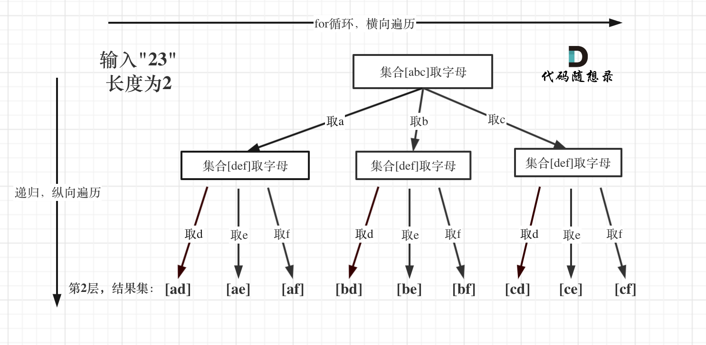

# 17. 电话号码的字母组合

Created: February 21, 2023 4:51 PM
Tags: 中等, 回溯算法

给定一个仅包含数字 2-9 的字符串，返回所有它能表示的字母组合。答案可以按 任意顺序 返回。

给出数字到字母的映射如下（与电话按键相同）。注意 1 不对应任何字母。

示例 1：

输入：digits = "23"
输出：["ad","ae","af","bd","be","bf","cd","ce","cf"]
示例 2：

输入：digits = ""
输出：[]
示例 3：

输入：digits = "2"
输出：["a","b","c"]

提示：

0 <= digits.length <= 4
digits[i] 是范围 ['2', '9'] 的一个数字。
链接：[https://leetcode.cn/problems/letter-combinations-of-a-phone-number](https://leetcode.cn/problems/letter-combinations-of-a-phone-number)

解题思路：

解决如下三个问题：

1. 数字和字母如何映射
2. 两个字母就两个for循环，三个字符我就三个for循环，以此类推，然后发现代码根本写不出来
3. 输入1 * #按键等等异常情况

解决方案

1. 使用回溯法实现多层for循环
2. 构建一个静态全局变量（map或者二维数组），string类型的数组，用于将数字符号映射为字母表
3. 遇到异常按键直接返回False



回溯三部曲：

一个字符串s来收集叶子节点的结果，然后用一个字符串数组result搜集符合条件的结果

1. 确定参数和返回值：string digits，int型的index，用于记录遍历数字字符串的起始位置
2. 确定终止条件：index == 输入的数字个数，将满足条件的结果存入result，return
3. 单层递归逻辑：取index指向的数字，并找到对应的字符集（手机键盘的字符集）。

然后for循环从第0个位置开始处理这个字符集

```cpp
// 版本一
class Solution {
private:
    const string letterMap[10] = {
        "", // 0
        "", // 1
        "abc", // 2
        "def", // 3
        "ghi", // 4
        "jkl", // 5
        "mno", // 6
        "pqrs", // 7
        "tuv", // 8
        "wxyz", // 9
    };
public:
    vector<string> result;
    string s;
    void backtracking(const string& digits, int index) {
        if (index == digits.size()) {
            result.push_back(s);
            return;
        }
        int digit = digits[index] - '0';        // 将index指向的数字转为int
        string letters = letterMap[digit];      // 取数字对应的字符集
        for (int i = 0; i < letters.size(); i++) {
            s.push_back(letters[i]);            // 处理
            backtracking(digits, index + 1);    // 递归，注意index+1，一下层要处理下一个数字了
            s.pop_back();                       // 回溯
        }
    }
    vector<string> letterCombinations(string digits) {
        s.clear();
        result.clear();
        if (digits.size() == 0) {
            return result;
        }
        backtracking(digits, 0);
        return result;
    }
};
```