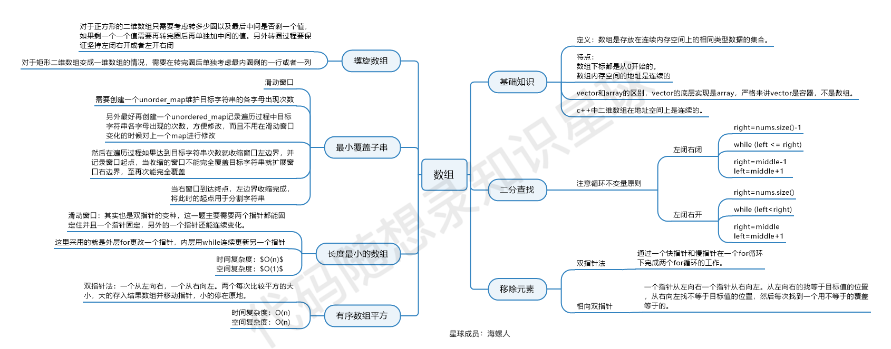
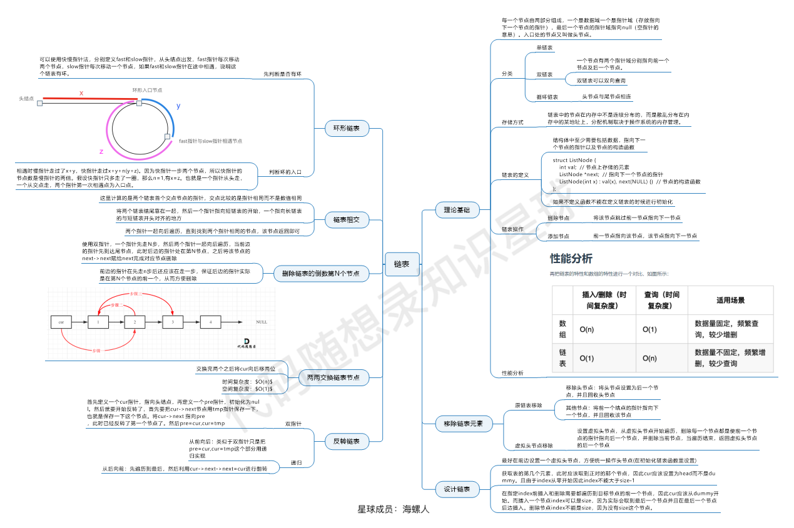
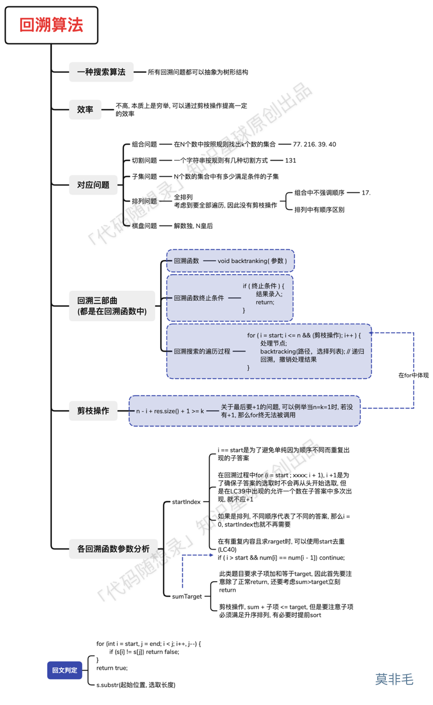
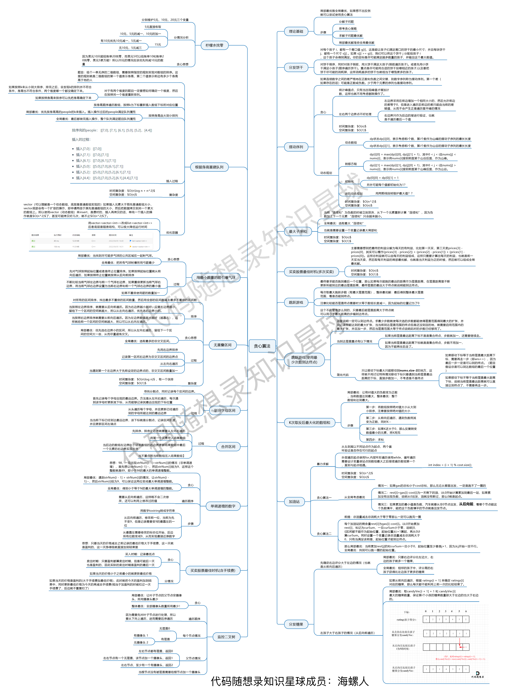
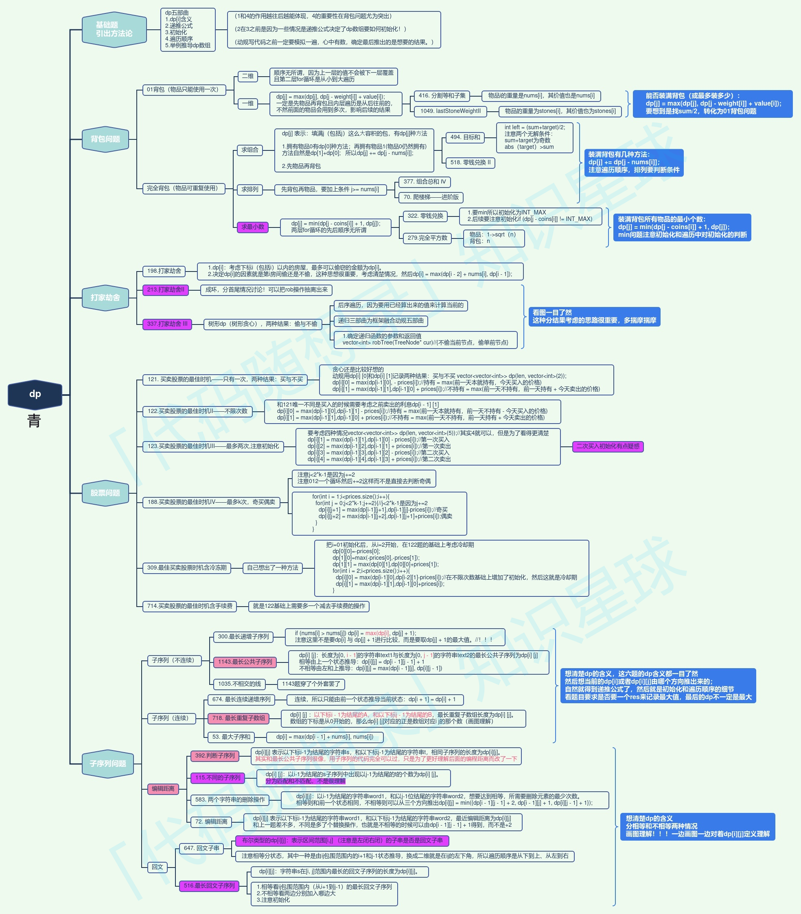

# 刷题总结
## 排序算法：

<https://github.com/amusi/Deep-Learning-Interview-Book/blob/master/docs/%E6%95%B0%E6%8D%AE%E7%BB%93%E6%9E%84%E4%B8%8E%E7%AE%97%E6%B3%95.md>

**冒泡排序：**升序，**比较相邻的两个元素，将大的值交换到右侧**，继续比较当前元素与下一个元素，**直到将最大的元素移动到序列末尾**。**在剩余的n-1个元素序列上重复上述比较操作**。单次迭代n个元素内部需两两比较n-1次。共执行n-(n-1)次迭代

冒泡排序的改进版本：**当某一轮循环当中没有交换位置的操作**，说明已经排好序了，就没必要再循环了，**break退出循环**即可。

**选择排序：**首先在未排序序列中找到最小（大）元素，存放到排序序列的起始位置，然后，再从剩余未排序元素中继续寻找最小（大）元素，然后放到已排序序列的末尾。以此类推，直到所有元素均排序完毕。

**插入排序：**将未排序元素一个个插入到已排序列表中。对于未排序元素，**在已排序序列中从后向前扫描，找到相应位置把它插进去；**在从后向前**扫描过程中，需要反复把已排序元素逐步向后挪，为新元素提供插入空间**。

**希尔排序：**（直接插入排序的改进）设待排序元素序列有n个元素，首先取一个整数increment（小于n）作为间隔将全部元素分为increment个子序列，所有距离为increment的元素放在同一个子序列中，在每一个子序列中分别实行直接插入。

**堆排序**：将待排序序列构造成一个大顶堆，此时，整个序列的最大值就是堆顶的根节点。将其与末尾元素进行交换，此时末尾就为最大值。然后将剩余n-1个元素重新构造成一个堆，这样会得到n个元素的次小值。如此反复执行，便能得到一个有序序列了。

**归并排序**：

**快速排序**：通过一趟排序将待排列表分隔成独立的两部分，其中一部分的所有元素均比另一部分的所有元素小，则可分别对这两部分继续重复进行此操作，以达到整个序列有序。（这个过程，我们可以使用递归快速实现）

[OJ在线编程输入输出练习](https://www.nowcoder.com/exam/test/67392064/detail?pid=27976983)

**熟悉常见的数学运算**

牛客网笔试C++输入输出：https://blog.51cto.com/u_15069443/3695341

牛客网C++常用输入输出格式：https://www.cnblogs.com/Allen-rg/p/13922965.html

**赛码网输入输出坑：vector在定义时不要初始化，否则会自动全部用0填充，导致之后输入的数据放不进去。**

**for循环适合模拟从头到尾的遍历，而while循环适合模拟环形遍历**

## 数组

## 使用sort函数进行正序和逆序排序：

sort函数默认将传入的迭代器元素升序（从小到大）排列，若改为降序（从大到小），需定义cmp函数

## 求某个数各个位置上数值之和

## 链表

## 双指针法：

设置快慢指针，设置慢指针初始值为0，设置快指针由for循环控制用于遍历**数组/链表**，当满足给定条件时，将快指针指向的值赋给慢指针，慢指针后移一位

双指针法求和需提前对数组排序

[**15.三数之和 (opens new window)**](https://programmercarl.com/0015.%E4%B8%89%E6%95%B0%E4%B9%8B%E5%92%8C.html)**的双指针解法**是一层for循环num[i]为确定值，然后循环内有left和right下标作为双指针，找到nums[i] + nums[left] + nums[right] == 0。

**四数之和的双指针解法**是两层for循环nums[k] + nums[i]为确定值，依然是循环内有left和right下标作为双指针，找出nums[k] + nums[i] + nums[left] + nums[right] == target的情况，三数之和的时间复杂度是O(n\^2)，四数之和的时间复杂度是O(n\^3) 。

如何移动left 和right呢， 如果nums[i] + nums[left] + nums[right] \> 0 就说明 此时三数之和大了，因为数组是排序后了，所以right下标就应该向左移动，这样才能让三数之和小一些。

如果 nums[i] + nums[left] + nums[right] \< 0 说明 此时 三数之和小了，left 就向右移动，才能让三数之和大一些，直到left与right相遇为止。

**逆波兰表达式求值（后缀表达式）**：适合用栈操作运算：遇到数字则入栈；遇到运算符则取出栈顶两个数字进行计算，并将结果压入栈中

## 滑动窗口：

用于求**长度最小/最大**的符合条件的**连续子数组长度/子元素个数**，使用两个指针实现，i指向窗口起始位置，j指向终止位置，for循环便利终止位置，当满足给定条件时，动态移动起始位置i

## 哈希问题容器的选择：要快速判断一个元素是否出现集合里的时候，就要考虑哈希法了

**数组：**统计已知数量的元素出现的次数，如判断判断两个字符串中字母出现的次数是否相同，共26个字母，创建长度为26的数组并初始化为0，**遍历第一个字符串时，array[s[i] - ‘a’] +1，遍历第二个字符串时，对应位置-1**，若遍历结束后，数组元素全为0，则出现次数相同

**set：**将数组转存为unordered_set相当于对数组执行**去重，且set可直接使用find函数查找元素是否存在。**

**map：**key-value结构。存储pair\<int, int\>对象在一个数组中寻找满足条件的两个数，并返回下表，使用map结构，key存储数值，value存下标。从头开始遍历数组，同时查找map中是否已有匹配值，若有则输出下标，若没有则把当前元素添加到map中

## 四数之和、三数之和

## 使用迭代器反转i～i+k区间内的字符串

## 字符串常用操作：

## KMP算法：

## 栈的常见问题：括号匹配、字符串重复元素消除、求逆波兰表达式

## 单调队列：单调递减或单调递增，用于求滑动窗口的最大值

## 优先级队列：求前k个高频元素

1.要统计元素出现频率-map

2.对频率排序-使用优先级队列（依据元素权值自动排序）或者将map转化为vector用快排

3.找出前K个高频元素

## 二叉树

## 二叉树的遍历：前中后指的是中间节点的位置

递归遍历模版：（前序）

迭代遍历模版：

前序：借用栈实现，先压入根节点，若栈不为空则弹出根节点，分别压入右子树根节点和左子树根节点，一直循环直到栈为空

中序：设置指针访问节点，然后栈处理节点上的元素

后序：需要调整一下先序遍历的代码顺序，就变成中右左的遍历顺序，然后在反转result数组，输出的结果顺序就是左右中

层序：借助队列实现，押入根节点，for循环遍历当前层所有节点，每弹出一个，就将其左右子树压入队列

## 回溯法能解决的问题：即模拟多层for循环

## 贪心：多次局部最优的叠加达到全局最优

## 动态规划，当前状态依赖于前一状态（可从前一状态推出），可解决

-   确定dp数组（dp table）以及下标的含义（一般题目求什么，什么就是dp数组）
-   确定递推公式
-   dp数组如何初始化
-   确定遍历顺序
-   举例推导dp数组

## 单调栈：解决 求某个元素左侧或右侧第一个比它大或比它小的元素