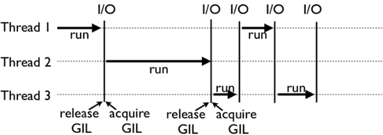

# 三、Python面试理论

## Python中可变和不可变对象是什么意思？

指对象内容的可变与不可变

**不可变对象 ：int，string，float，tuple** ，如不可变对象做**加减操作 == 创建了新对象**，然后让该变量指向新创建的对象

**可变对象 ：list，dictionary**，可以更改对象的内容如向list中添加元素，指向该list对象的引用并未发生变化

## tuple、list 和 dict 的区别

list：元素集合，用[ ]定义，通过序号访问，append添加，pop删除

tuple：不变的list，用( )定义，通过序号访问，希望一个函数返回多个返回值，其实只要返回一个tuple就可以了

dict：key-value键值对，用{}定义，通过key访问，访问效率高

set：去掉key的dict，无重复list，通过调用set() 创建

## Iterables、Iterator、generator 和 yield的区别

**Iterables：可迭代类型。**python中可以对其内部进行遍历的类型都是iterable，任何一个**包含返回值为**[**迭代器（iterator）**](https://blog.csdn.net/DooDia/article/details/122667865?spm=1001.2101.3001.6650.6&utm_medium=distribute.pc_relevant.none-task-blog-2%7Edefault%7EBlogCommendFromBaidu%7ERate-6-122667865-blog-97694985.pc_relevant_aa&depth_1-utm_source=distribute.pc_relevant.none-task-blog-2%7Edefault%7EBlogCommendFromBaidu%7ERate-6-122667865-blog-97694985.pc_relevant_aa&utm_relevant_index=7#iterator)**的__iter__方法的对象，和包含支持下标检索的__getitem__方法的对象**都是一个iterable。常见的iterable包括list，dict，str，set, tuple等

**Iterator：迭代器，**是一个**定义了__next__方法的对象，__next__和__iter__方法构成了迭代器协议，**前者返回下一个元素，后者返回迭代器自身。

**generator：生成器。返回迭代器对象**节省内存，**生成器直到运行时才会生成值写进内存**，此时前一个值就被抛弃。当然内存的节省必然有其代价，生成器内的元素只能进行一次遍历

**yield：用于生成器函数，**类似于return的关键字，但不同的是**带有yield的函数就变成了一个generator，每次执行到yield的时候返回一个生成的对象并保存当前运行状态，直到下一次调用next()继续运行下一轮迭代。**

## Python 的装饰器

Python的函数可像普通变量一样当作参数传递给另外一个函数，func( )表示调用函数，单纯传递名称func表示将函数作为参数传递

装饰器本质上是一个 **Python 函数**或**类**，可以**抽离出大量与函数功能本身无关的雷同代码到装饰器中并继续重用**。概括的讲，装饰器的作用就是为已经存在的对象添加额外的功能。

**函数举例：**

类举例：当使用 @ 形式将装饰器附加到函数上时，就会调用类的__call__方法。
f = a(b(c(f)))执行顺序是从里到外，最先调用最里层的装饰器，最后调用最外层的装饰器

## 使用迭代器遍历和非迭代器遍历区别？

-   遍历列表，表头位置始终不变；
-   遍历迭代器，表头位置相应改变；
-   next 函数执行一次，迭代对象指向就前进一次；
-   StopIteration 触发时，意味着已到迭代器尾部；

## Python的全局锁（GIL：全局解释器锁）

在 CPython 解释器中执行的每一个 Python 线程，都会先锁住自己，以阻止别的线程执行，**通过线程之间的交替执行模拟真正并行的线程，具体的实现方式：为某个内存中的带访问数据设置引用计数**

CPython 使用引用计数来管理内容，所有 Python 脚本中创建的实例，都会配备一个引用计数，来记录有多少个指针来指向它。当实例的引用计数的值为 0 时，会自动释放其所占的内存。假设有两个 Python 线程同时引用 a，那么双方就都会尝试操作该数据，很有可能造成引用计数的条件竞争，导致引用计数只增加 1（实际应增加 2），这造成的后果是，当第一个线程结束时，会把引用计数减少 1，此时可能已经达到释放内存的条件（引用计数为 0），当第 2 个线程再次视图访问 a 时，就无法找到有效的内存了。

## Python 字典采用的是什么数据结构？

答：使用的是key-value匹配的**哈希结构**

## Python 的 append 和 extend 有什么区别？

extend与append方法都是将新接收到参数放置到已有列表的后面。 **extend方法只接收list，把这个list中的每个元素添加到原list中**。 而**append方法可以接收任意数据类型的参数**，并且简单地追加到list尾部。

## Python 的浅拷贝和深拷贝

-   **直接赋值：**其实就是**对象的引用**（别名）。
-   **浅拷贝(copy)：拷贝父对象**，不会拷贝对象的内部的子对象。
-   **深拷贝(deepcopy)：** copy 模块的 deepcopy 方法，**完全拷贝了父对象及其子对象**。

## Python的内存回收机制

python 采用的是**引用计数机制**为主，**标记 - 清除**和**分代收集**两种机制为辅的策略

**引用计数机制**：每个对象维护一个**计数字段**记录该对象当前被引用的次数，被引用时+1，失效时-1，清零后该对象立即被回收，对象占用的内存空间将被释放。

**标记-清除**：分为两个阶段：第一阶段是标记阶段，GC 会把所有的『活动对象』打上标记，第二阶段是把那些没有标记的对象『非活动对象』进行回收。对象之间通过引用（指针）连在一起，构成一个有向图，可达的节点即为活动对象，不可大为非活动对象

**分代收集**：内存根据对象的存活时间划分为3个不同的集合，分别为年轻代（第 0 代）、中年代（第 1 代）、老年代（第 2 代），对应的是 3 个链表，它们的垃圾收集频率与对象的存活时间的增大而减小。新创建的对象都会分配在年轻代，年轻代链表的总数达到上限时，Python 垃圾收集机制就会被触发，把那些可以被回收的对象回收掉，而那些不会回收的对象就会被移到中年代去，依此类推。分代回收是建立在标记清除技术基础之上

**使用gc模块自动垃圾回收**：有三种情况会触发垃圾回收：

1.  调用gc.collect(),需要先导入gc模块。
2.  当gc模块的计数器达到阀值的时候。
3.  程序退出的时候。