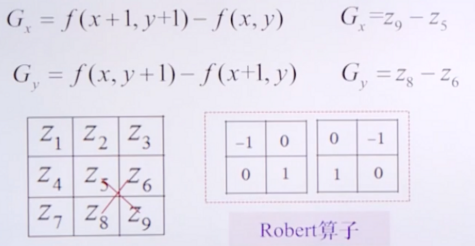
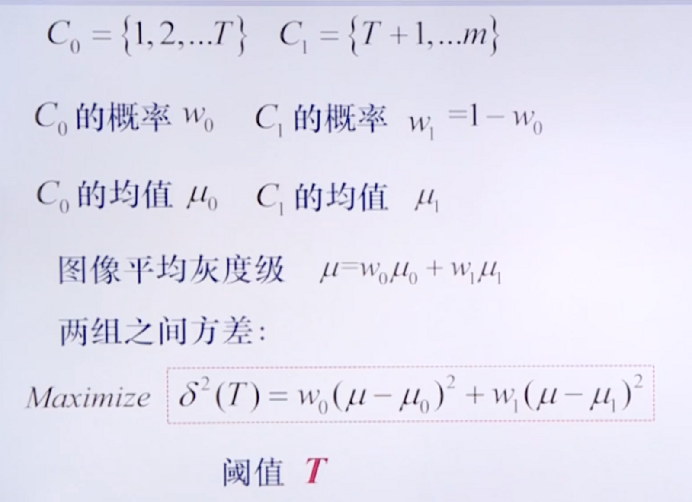

# 十一、传统图像处理基本知识

## 图像相关的基本概念：

### 模拟图像与数字图像：

模拟图像：通过某种连续的物理量（如光或电的强弱变化）记录图像的亮度信息

数字图像：采用数字表示记录图像的亮度信息

模拟图像通过采样和量化可转换为数字图像

一切肉眼能看见的，都是模拟图像

### 模拟信号如何通过采样和量化转化为数字信号

对于一维模拟信号，可对横轴（时间t）进行等间隔采样，对纵轴（幅值）进行量化（即取采样点对应的幅值大小）可得到一系列数字即数字信号

### 模拟图像如何通过采样和量化转化为数字图像：空间采样和亮度量化

模拟图像即二维函数：需要在两个维度上均等间隔采样（栅格化操作），对每个格子中心点的亮度（灰度级）进行量化

灰度级越大图像越亮

### 空间分辨率与亮度分辨率，分别用于衡量采样和量化的精度

空间分辨率：衡量模拟图像转化为数字图像的空间精度，eg：采样间隔4\*4分辨率清晰度 \> 采样间隔8\*8分辨率清晰度

亮度分辨率：256灰度级清晰度\>8灰度级清晰度

### 常见的图像存储格式

**BMP**：采用位映射存储格式，与硬件设备无关 除了色彩分辨率可选以外，不采用其他任何压缩 扫描格式是按从左到右、从下到上的顺序

**JPEG**：采用有损压缩方式去除图像数据中的冗余信息 可以在获取极高的压缩率的同时保持图像质量

**GIF**：一种连续色调的无损压缩格式，压缩率在50%左右 存储量相对小，成像清晰，适合于初期的互联网

**PNG**：便携式网络图像格式 存储量相对小，压缩比高

### 颜色空间

-   **RGB**是依据人眼识别的颜色定义，将色调，亮度，饱和度放在一起表示
-   HSI / HSL（色调饱和度和强度）为更好的数字化处理颜色二提出
-   CMY / CMYK为工业印刷颜色空间，与RGB对应。RGB来源于是物体发光，而CMY是依据反射光得到的。具体应用如打印机：一般采用四色墨盒，即CMY加黑色墨盒
-   YUV / YCbCr 通过**亮度-色差**来描述颜色，亮度信号经常被称作Y，色度信号是由两个互相独立的信号组成。表示颜色系统和格式不同，两种色度信号经常被称作UV或PbPr或CbCr。这些都是由不同的编码格式所产生的，但是实际上，他们的概念基本相同。在DVD中，色度信号被存储成Cb和Cr（C代表颜色，b代表蓝色，r代表红色）。

### OpenCV 读取图像存储的顺序为什么是 BGR，而不是 RGB

历史原因，早期的摄像头数据采集、图像数据保存时，像素通道为B、G、R顺序存放的，一直沿用下来这样的保存格式了

### 图像开发中字节数计算规则

保存**一行像素的数据需要4字节对齐**，不足的要补充空字节对齐。eg：RGB格式，宽350\*480的图像，一行像素正常需要350\*3=1050字节，但为了四字节对齐，需要补充3个字节变为1052，那么整张图像需要1052\*480=504960个字节

## 灰度直方图的定义、性质和应用

**定义：统计灰度级出现的次数**从而描述图像，x轴为灰度级，y轴为具有某个灰度级的像素个数

**性质**：a、灰度直方图分布比较均匀时，图像可以呈现出更多的细节；b、一个灰度直方图可以对应多个图像：只统计了灰度级出现的次数、未统计灰度级出现的位置

**应用**：

-   图像增强：即直方图均衡（目标：是图像更清晰，展现更多细节）
-   图像分隔：根据直方图获取分割阈值
-   图像分类：直方图对比

## 图像增强的定义：

按照特定需要突出或去除图像中的某些信息（噪声、提升清晰度、意义不明等），改善图像效果使其便于分析和理解

## 实现图像增强的方法：灰度变换、滤波器、代数运算

1、**灰度变换**：将原始图像的灰度分布变幻到人眼敏感的区域之内（包括**线性变换和非线性变换**）

2、**滤波器去除噪声**：设计滤波函数（滤波器相同，可以从空间域和频率域两个角度理解分为**空间滤波｜频率滤波**）（**低通滤波和高通滤波等**）

3、**代数运算**：若干图像求平均去除随机噪声（加减乘运算）

灰度变换、空间滤波和代数运算**直接对图像中的灰度级进行操作**，属于空间域增强；频率滤波先对图像进行傅里叶变换，**对变换后的系数操作**，属于频率滤波

## 灰度变换的定义：

使用**灰度变换函数**对直方图函数进行拉伸（函数斜率大于1）和压缩（函数斜率\>0且\<1）

**灰度拉伸**：将某区域的**像素灰度值变大**；灰度压缩：将某区域的**像素灰度值变小 \| 不变**

#### 常用的灰度变换函数：对数变换、幂次变换和直方图均衡

灰度级越大，图像越亮

|            | **操作**                                                                 | **结果**                                                                                       |
|------------|--------------------------------------------------------------------------|------------------------------------------------------------------------------------------------|
| 对数变换   | 拉伸灰度级较暗（小）的区域，压缩灰度级较亮（大）的区域                   | 窄带低灰度图像（过暗的图像） —\> 宽带 输出图像                                                 |
| 幂次变换   | gama\>1: 拉伸灰度级较亮（大）的区域；gama\<1: 拉伸灰度级较暗（小）的区域 | 高灰度输入图像 （过亮的图像） —\> 宽带输出图像；窄带低灰度图像（过暗的图像） —\> 宽带 输出图像 |
| 直方图均衡 | 确定目标直方图，依据灰度变换前后直方图关系推导出变换函数                 | 使得每个灰度级都拥有像素、且直方图分布均匀                                                     |

## 直方图均衡的具体计算公式(需会手工计算变换后的灰度图)

设**DA**是变换前的灰度级，**HA(DA)**是灰度级对应的像素点个数；设**DB**是变换后的灰度级，**HB(DB)**是灰度级对应的像素点个数。

已知变换后每个灰度级拥有相同的像素个数，即**HB(DB) = C = 像素点总数/灰度级**，如8灰度级64\*64图像

已知变换函数为f，即**DB = f(DA)**

已知变换后灰度级对应的像素点个数 = 变换前灰度灰度级对应的像素点个数/变换函数的导数，即**HB(DB) = HA(DA) / f(DA)求导**

可推得：

两边同时求积分可得：

具体计算流程：1、先计算当前灰度级变换至哪个灰度级；2、计算灰度级对应的像素点个数；3、绘图

## 代数运算的具体操作及应用

-   **加法运算**（两幅或多幅图像想家取均值）：用于**去除叠加性噪声**，图像越多，去噪效果越好
-   **减法运算**（两幅图像相减，eg：原图-背景图后做二值化操作）：用于**分割特定区域、检测场景变化**
-   **乘法运算**（两幅图像相乘，eg：图像\*mask图像）：用于**获取图像中的特定部分**

## 图像为什么要滤波？

a.消除图像在数字化过程中产生或者混入的噪声。

b.提取图片对象的特征作为图像识别的特征模式。

## 滤波器该如何去理解?

滤波器可以想象成一个包含加权系数的窗口或者说一个镜片，当使用滤波器去平滑处理图像的时候，就是把通过这个窗口或者镜片去看这个图像。

## 空间滤波器/滤波函数/滤波核（类似于卷积核）

**定义：使用滤波核直接操纵像素灰度级**

空间滤波器包含**低通滤波器**和**高通滤波器**两种：

**低通滤波器**（用于**图像平滑，去噪**）使用**滤波核**对覆盖区域内的**像素点灰度级求加权平均**（积分运算）作为新的像素值；

**高通滤波器**（**得到图像边缘，用于图像锐化**）使用滤波核对**覆盖区域内的像素点求积分（x方向导数和y方向导数绝对值之和）**判断像素点是否为图像边缘

1.  分别求某个像素点（位置）在x方向和y方向上的梯度（目的：得到像素值的变化情况）

    

    

    

    2、平坦区（灰度不变区域）：差分值 = 0

2.  边缘（灰度变化区域）：差分值 ≠ 0

依据求积分的方式和阶数的不同，可将高通滤波器分为不同的算子(加权核)：

## 一阶差分核和二阶差分核的区别

-   **一阶导数**可检测图像中的某个像素点**是否在边缘上**（边缘上的像素点一阶导为正，其他区域像素点一阶导为0）
-   **二阶导数**可以判断一个边缘像素点**在亮的一面或暗的一面（边缘与黑色交界处二阶导数为正，与亮色交界处二阶导为负）**

#### 常见的空间低通滤波器（滤波核）

**图像均值滤波器**：滤波核 \* 对应位置的像素、求和、取平均

**高斯低通滤波器**：是根据高斯函数的形状来选择权值的线性平滑滤波器，用于**消除高斯噪声**

eg：中心点加权为4，四领域加权为2，八领域加权为1，求和后/16以保证所有权重值相加和为1

低通滤波器的**优点**：有效抑制噪声值；

低通滤波器的**缺点**：降低了原图像像素值之间的差异，导致边缘模糊

## 高斯噪声

噪声在图像当中常表现为一引起较强视觉效果的孤立像素点或像素块。简单来说，噪声的出现会给图像带来干扰，让图像变得不清楚。 高斯噪声指概率密度函数服从高斯分布（即正态分布）的一类噪声。如果一个噪声，它的幅度分布服从高斯分布，而它的功率谱密度又是均匀分布的，则称它为高斯白噪声。

## 中值滤波器（解决低通滤波器的缺点）

对滤波核**覆盖的所有像素点排序，然后取中间值**作为最终结果；

**优点：**能有效去除脉冲噪声、去噪的同时能有效的保留边缘信息

## 什么是图像锐化

锐化后的图像 = 原始图像 + 图像边缘，可突出图像的细节特征，增强图像的模糊边缘

## 常见的空间高通滤波器（差分核）/常见的边缘检测算子：Robert算子（交叉差分算法）、prewitt算子、Sobel算子、Laplace算子

可将Gx，Gy可视化表示为**差分核：**

## Laplace算子的优缺点：

对噪声敏感；不能检测边缘的方向；零交叉性质进行边缘定位

## Sobel算子的优缺点：

对噪声不敏感；可以检测边缘方向；无法进行边缘定位

## Sobel算法

## 时间域与频率域

时间域：时间时横坐标，振幅是纵坐标

频率域：频率是横坐标，振幅是纵坐标

## 图像的低频信号与高频信号

**空间频率**指的是**图像中灰度值相对它的邻居点变化方式**。如果一副图像中灰度从一边到另一边**变化很小**，那就说这副图像是**低频信号**。如果某些像素相对于它邻近的像素点**变化很剧烈**，则说明该图像含有**高频信号**.

图像中的**高频分量**，指的是**图像强度（亮度/灰度）变化剧烈的地方**，也就是我们常说的**边缘（轮廓）**；图像中的**低频分量**，指的是**图像强度（亮度/灰度）变换平缓的地方**，也就是大片色块的地方。人眼对图像中的高频信号更为敏感。

## 频率滤波器：

<https://zhuanlan.zhihu.com/p/387352802>

## 频率域滤波的步骤

## 计算傅里叶变换：傅里叶变换的本质是在求积分

## 二维离散傅里叶变换的性质

| **性质** | **特征**                                                                                |
|----------|-----------------------------------------------------------------------------------------|
| 平移特性 | f(x,y) \* 相移 = 频谱在频域的平移 F(u-u0, v-v0)                                         |
| 旋转特性 | 图像旋转角度a = 频谱旋转角度a                                                           |
| 尺度放缩 | 图像域放大 = 频率域缩小                                                                 |
| 卷积性质 | 空间域的卷积 = 频率域的乘积；空间域的乘积 = 频率域的卷积；（频率滤波的原理）            |
| 相关性质 | 图像相关性运算可用于感兴趣区域匹配                                                      |
| 分离性质 | 二维离散傅立叶变换 = 两个一维傅立叶变换的叠加（先计算行傅立叶变换、再计算列傅立叶变换） |

## 常见的频域滤波器

### a) 低通滤波器：

设置截止频率，允许低频成分通过，去除高频成分 --\> 效果：平滑图像；具体应用：去除栅格，去除人脸皱纹，文本图像中字符失真和断裂修复

-   **理想低通滤波器(有振铃现象：逆傅里叶变换后得到的原函数呈周期性波动)**

    设在频率域中存在点,,即表示点到原点的距离，则有**理想低通滤波器**:

    

-   **Butterworth低通滤波器（有振铃现象）**

    

-   **高斯低通滤波器（无振铃现象）**若H(u,v)是高斯函数，那么其傅立叶变换的反变换h(x,y)也是高斯函数，因此高斯滤波器无振铃现象

    

### b）高通滤波器：

设置截止频率，允许低频成分通过，去除高频成分 --\> 效果：得到图像边缘; 具体应用：原图+高通滤波器提取的边缘 = 高频增强图像（突出图像细节）

-   **理想高通滤波器(振铃现象)**

    

-   **Butterworth高斯滤波器**

    

-   **高斯高通滤波器**

    

### 低通滤波器和高通滤波器的缺陷：可以解决加性噪声问题，无法消减乘性噪声或卷积性噪声

### c）同态滤波器：

人眼对亮度的响应类似于对数运算 --\> 抑制低频，增强高频，基于**图像成像模型**，在**频域压缩灰度动态范围**，从而达到**增强图像对比度**的效果

### d）基于Retinex滤波：

基于图像成像模型：目标为从公式中估算出R(x,y)

## 图像的形态学处理操作：膨胀、腐蚀、开运算、闭运算

**运算流程：**给定二值图像I(x，y) ；结构元素的二值模板T(i，j)；输出二值图像E(x，y)

常用的结构元素二值模板：

**膨胀（或运算）：**使用某个**结构元素**与**原图**执行**或运算**，效果将与物体接触所有背景点合并到该物体中使边界向外部扩张，可以用来填补物体中的空洞，eg：字符断裂修复，即平滑图像

**腐蚀（与运算）**：使用某个**结构元素**与**原图**执行与运算，消除边界点，使边界向内部收缩的过程，用来消除小且无意义的物体，**当B完全放入A中时才满足腐蚀条件，因此由边界B的中心点构成的区域为最终计算的结果**eg：匹配、去除字符毛刺

**开运算（腐蚀+膨胀）**：消除小物体，在纤细处分离物体、平滑较大物体边界的同时不改变其面积

**闭运算（膨胀+腐蚀）**：填充物体内部的小空间、连接临近物体，平滑物体边界的同时不改变其面积

## 形态学操作的应用实例

**边界提取**：原图-腐蚀图像 = 边界；膨胀图像-原图 = 边界

**识别物体形状**：使用指定形状的二值模板分别探测图像的内部和外部，从而确定物体形状

## 图像分割的定义：将图像划分为若干不相交的具有相同属性的小区域

## 图像分割方法：

-   基于**阈值**的图像分割：某个像素点的灰度级大于某一阈值，则分割后图像对应像素位置设为1，否则设为0
-   基于**边缘**的图像分割：检测**位于两个区域边界的图像边缘**
-   基于**区域**的图像分割：利用图像像素的**空间性质**，分隔出油**相似性质**属于同一个区域的像素（区域生长法；分裂合并法）
-   基于**学习**的图像分割：预处理图像、将图像分割建模为像素点分类问题，训练特征提取器将像素点分类至指定区域

### 基于阈值的图像分割（得到二值化的分割结果）

设原始图像为，分割后图像为，灰度级阈值为T，阈值依据计算使用的图像区域不同分为**全局阈值**（T取决于整幅图像），**局部阈值**（T取决于部分图像）和**动态阈值**（T取决于空间坐标（x,y））：

### 阈值的计算方法1-直方图技术

适用于前景和背景灰度分布值差别较大，且前景灰度分布比较均匀的图像

-   **简单图像（直方图呈现双峰）：**选择**峰谷的值作为阈值**
-   **较复杂图像**：计算**全局阈值**
1.  确定初始阈值，灰度级T=127（依据直方图指定一个可能的估计值）;
2.  依据初始阈值将像素值分为两组G1和G2;
3.  分别计算区域G1和G2的平均灰度a1和a2;
4.  计算新阈值T = (a1+a2) / 2;
5.  重复2-4，直到逐次迭代所得的T之差小于事先设定的参数
-   **特别复杂的图像（直方图有很多波峰，每个波峰代表图像的一部分内容）：双阈值法，**，保留峰值两侧指定范围内的像素点，实现图像粗分割

### 阈值的计算方法2-最小误差阈值法

最小化**目标被错分为背景的概率和背景被错分为目标的概率之和（即求概率公式导数为0时的T值）**

缺点：目标及背景的概率密度函数较难获得

设目标及背景的概率密度函数分别为，目标占整体图像的比例为a，可得整幅图像的概率密度函数为：；设用于分割的灰度级阈值为t，则目标被错分为背景的概率；背景被错分为目标的概率，错误分割的概率 = 

即令求得阈值t

### 阈值的计算方法3-最大方差阈值法

**利用统计值近似概率密度函数。**优点：算法可操作性强；直方图是否有双峰均可以得到满意的效果**（应用广泛）**

**设某个灰度级 i 出现的概率 pi = 灰度级i的像素点个数 / 图片像素点总数**

1、利用**直方图**选取初始阈值

1.  阈值将图像像素分为**两组**G1和G2
    1.  G1的概率,G2的概率;
    2.  G1和G2的灰度级均值（平均灰度）

        

3、计算两组像素之间的**方差**

4、找到使**方差最大**时的阈值

### 基于边缘的图像分割（输出二值化的分割结果）

**核心：**检测位于两个区域边界的图像边缘

**方法：**1、一阶或二阶导数算子（空间滤波）；图像高通滤波器（频率滤波）

**算子的选取标准：**

-   检测精度：边缘算子应该只对真正的**边缘有响应**
-   定位精度：检测边缘与真边缘像素**距离**应尽可能小
-   单边响应：在**单边存在**的地方，结果不应出现多边

### 多级边缘检测算法-Canny算子

1.  使用高斯滤波平滑图像（**降噪**）：用一个高斯矩阵乘以每一个像素点及其邻域，取其带权重的平均值作为最后的灰度值
2.  寻找**边缘**：通过点乘sobel等算子计算某个位置的像素点在不同方向上的梯度之和梯度方向

    

3.  **非极大值抑制**：在高斯滤波过程中，边缘有可能被放大了。使用非极大值抑制过滤不是边缘的点，使边缘的宽度尽可能为1个像素点：如果一个像素点属于边缘，那么这个像素点在梯度方向上的梯度值是最大的。否则不是边缘，将灰度值设为0。

    

4.  使用**上下双阈值检测边缘**：它设置两个阀值（threshold），分别为maxVal和minVal。其中大于maxVal的都被检测为边缘，而低于minval的都被检测为非边缘。对于中间的像素点，如果与确定为边缘的像素点邻接，则判定为边缘；否则为非边缘。

    

### 边缘检测算法-霍夫变换（直线和圆的检测）

<https://zhuanlan.zhihu.com/p/203292567>

**应用**：1、解决边界检测中受噪声光照影响导致的边界点不连续问题；2、能够解析定位直线/曲线/任意形状

**基本流程**：将边界点从笛卡尔坐标系转换至霍夫空间（即参数空间），笛卡尔空间中的每个点对应霍夫空间中的一条线，若多个点在dkr坐标系中共线，则其在参数空间中的对应直线会相交于一个点，Hough变换会取直线数量最多的交点作为结果参数，这些直线对应的结果为边界

**缺点**：1、在hough变换前需要对图像做二值化并检测边缘；2、hough变换会损失原始图像中的许多信息

### 区域的基本定义：

将区域划分为n个子区域，区域需满足以下5个条件：

1.  完备性：各个子区域之和 = 总区域大小
2.  连通性：任意一个 子区域都是连通域
3.  独立性：任意两两子区域不相交
4.  单一性：区域内灰度级相同
5.  胡出行：任意两个子区域灰度级不等

### 区域生长法：

**基本流程：**

1、对每个需要分割的区域找一个**种子像素**作为生长的起点

2、判断种子像素周围邻域中与种子像素是否具有**相似性质**

3、若具有相似性质，则将该像素**合并**到种子像素所在的区域

4、将这些新像素当作**新的种子像素**继续进行上面的过程

5、直到再没有满足条件的像素可被包括进来

**核心问题1: 如何确定种子像素**

-   通过**基于阈值的方法**找到某个区域的大致位置（eg基于直方图粗分割的结果）
-   通过**人机交互指定**初始种子像素

    **核心问题2: 如何种子像素之间的相似性**

-   **基于区域灰度差**

    ****

-   **基于区域灰度分布统计性质**
    -   把像素分成互不重叠的小区域
    -   比较邻接区域的累积灰度直方图
    -   根据灰度分布相似性进行区域合并；

        

### 区域分裂合并法

**基本流程：**把图像分成任意大小且**不重叠**的区域，再**合并或分裂**这些区域以满足分割要求

**核心问题：一致性测度**

-   **基于区域灰度统计特征**（如同质区域中的方差）：先将区域分为若干份，然后将方差不一致的区域继续划分为若干份，不断重复，直到各个小区域内部方差全部一致；合并方差满足条件的相邻小区域，从而得到分割结果

## 线性插值、最近邻插值、双线性插值<https://zhuanlan.zhihu.com/p/513569382>

## 执行图像特征提取的原因：

对于有多种特征的原始图片，可能无法对其进行线性分类，通过对原始特征进行一定的特征转化，可以使线性分类器更好的工作。

eg：对于呈圆形分布的点，可以通过直角坐标系和极坐标系的转换来更好的进行分类。

## 处理图像特征的基本步骤

计算输入图片的各种特征代表，然后将图像不同的特征合并为一个特征向量送入线性分类器

## 图像预处理和特征提取方法列举：

### 逐像素转换方法：遍历图像所有像素点，并针对于每个像素点计算变化后的像素值

### 白化：令所有像素点对应的灰度值均值为0，方差为1。像素点灰度值为pij，计算所有像素点灰度值的均值和方差，使用该统计量对每个像素点灰度值进行转换

彩色图像：可计算所有通道像素点的均值和方差，也可单独计算每个通道的均值和方差

### 直方图均衡化

### 线性滤波：新的像素值xij由原始图像P周围区域的像素灰度级的权值和构成

-   **高斯滤波器**：模糊降噪，模糊程度取决于滤波器中的标准差.

    

    -   **一阶微分滤波器与边缘滤波器**：定位边缘（Sobel算子、Prewitt算子）
    -   **拉普拉斯滤波器**：识别图像中的感兴趣区域，**缺陷**：会输出含噪声的结果
    -   **高斯-拉普拉斯（LOG）滤波器**：先用高斯滤波器去噪，再用拉普拉斯滤波器提取感兴趣区域
    -   **高斯差分（DOG）**：对一副图像使用两次高斯函数，取结果间的差异为最终结果，可作为LOG的近似
    -   **Gabor滤波器**：二维高斯函数与二维正弦函数的乘积，该滤波器对**模糊程度（****）**以及**边缘方向（不同的正弦波相位方向和波长）**均具有选择性
    -   **Hear-like滤波器**：由相邻的矩形平衡区域构成，平均滤波值为0，类似于微分滤波，噪声敏感

### 局部二值模式（LBP算子）

**应用**：提取图像局部纹理特征；优点：旋转不变性和灰度不变性

**计算方式：**

1.  以中心像素的灰度级为标准，将**8领域像素灰度级与中心像素比较**，若大于中心像素，赋值1，小于中心像素，赋值0；
2.  将得到的二进制值按**指定的顺序（随机）**连接，并转化为**十进制数**用于表示该**窗口内的局部图像纹理特征；**

**缺点：LBP对光照强度变化不敏感**：当光照变化引起窗口内的**像素点的灰度值同步增大或减小**时，LBP值变化不明显

**改进1：圆形LBP：**将LBP拓展至更大的窗口，并使用**圆形领域替代方形领域**，对应位置的灰度值使用**双线性插值估计**。

**改进2：旋转不变的LBP：**将原始的LBP（或圆形LBP）得到的8位(P位)LBP值进行循环移位操作，得到8个（P个）不同的值，取其中的最小的一个值作为最终的LBP值

**改进3：等价模式的LBP**

含有P个采样点的LBP会有种模式，为了降维，可以采用“等价模式”。

对于8位的二进制序列，如果它从0到1或者从1到0的变化次数不超过2次，那么它就是一个“等价模式”，比如“00011100”就是一个“等价模式”，“10100000”不是等价模式。共有58种“等价模式”。

这58种“等价模式”作为58类，其余的非等价模式作为一类，这样所有的 LBP值一共就被分为了59类。因此在统计直方图的时候，直方图的维度就从256降低到了59。

**使用LBP算子对图像提取特征:**

-   将图像划分为BxB大小的cell；
-   对于cell中的每一个像素，计算LBP值；
-   对于每一个cell，计算cell中所有像素的LBP值的直方图，并进行归一化；
-   将所有cell的直方图连接作为一个特征向量，作为全图的特征向量。

**LBP算子的优点：**

-   一定程度上缓解光照变化带来的问题。
-   具有旋转不变性。
-   特征维度低，计算速度快。

**LBP算子的缺点：**

-   如果光照不均匀，那么LBP值就不能反映真实的纹理特征。
-   对方向敏感。

### 纹理基元映射（用于图像语义分割）

**纹理基元**等价于语音识别的因素，不同的取值可以表示不同的纹理类型

输入：图像 --\> 对每个位置计算纹理基元并依据计算值将基元分配至指定类别 --\> 输出：纹理基元映射图

具体计算流程：

1.  指定包含N个滤波器的滤波器组（可选滤波器类型：高斯函数、高斯导数和LOG的组合；旋转不变性滤波器；最大响应数据库等），在图像的每一个位置执行卷积操作，将输出串联成N\*1的向量
2.  使用K均值算法将向量聚成K个类别
3.  新图像的纹理基元 = 使用相同的滤波器组卷积生成
4.  每一个像素纹理基元的分配通过比对和聚类中心的相似性决定

### 边缘、角点和兴趣点的检测（识别图像信息）

**边缘检测问题定义：**输出二值图像，非零数值表示图像中的边缘

**角点：**包含丰富视觉信息的位置，可以更好地用于定位，通常用于**图像对齐、图像拼接(拍摄全景图)、目标识别、3D重建、运动跟踪**（称为兴趣点）

### Canny边缘检测器

### Harris角点检测器

<https://zhuanlan.zhihu.com/p/83064609>

一阶导数(即灰度图的梯度)中的局部最大所对应的像素点就是角点

Harris 角点检测算法分为以下三步：

1.  当窗口（小的图像片段）同时向 x 和 y 两个方向移动时，计算窗口内部的像素值变化量；
2.  对于每个窗口，都计算其对应的一个角点响应函数 R；
3.  然后对该函数进行阈值处理，如果 R \> threshold，表示该窗口对应一个角点特征。

### SIFT尺度不变特征转换器

<https://www.jianshu.com/p/bec33c7c333d>

<https://zhuanlan.zhihu.com/p/384975112>

1.  使用K个递增粗尺度的高斯差分核对图像进行滤波
2.  将滤波图像堆叠生成三维数组H x W x K
3.  对于每个像素点，基于其26领域的值寻找极值
4.  为每个关键点赋一个唯一的方向

### SIFT 特征为什么能实现尺度不变性？SIFT特征是如何保持旋转不变性的？

基于图像局部的梯度方向，分配给每个关键点位置一个或多个方向。所有后面的对图像数据的操作都相对于关键点的方向、尺度和位置进行变换，从而提供对于这些变换的不变性。

### 常见的视觉描述子

**描述子是什么**：对**图像区域内容**的表达方式

#### 直方图：

绘制区域响应（如像素灰度级、滤波器的输出等）直方图

适用范围：不需要图像空间信息的情况

#### SIFT特征描述子：

<https://zhuanlan.zhihu.com/p/459136666>

#### 方向梯度直方图HOG：

测量图片中局部向量的方向。获取原始图片，将图片按8\*8像素区划分，在划分后的每一个像素区计算每个像素值的主要边缘方向，将边缘方向量化到几个组。然后在每一个区域内计算不同的边缘向量得到一个直方图（能够从图片中看出有哪些不同类型的边缘）

<https://zhuanlan.zhihu.com/p/445740963>

#### 词袋描述子：统计描述子数据以表示整幅图像

1\. 定义视觉单词字典：

-   从图像中进行小的随机块采样
-   采用K均值等方法将他们聚合成簇，得到不同的蔟中心，簇中心代表了图像中视觉单词的不同类型

2\. 使用视觉单词编码图像（Encode image）：计算某一个视觉单词会在图像中出现的次数作为特征向量编码图像

#### 形状内容描述子：编码轮廓点，描述目标轮廓的固定长度

## 平移、旋转、缩放、错切变换

## 仿射变换(平面变换或二维变换)：变换 = 变换矩阵\*坐标向量

方程组有6个未知数，求解需要找到3组映射点（3点确定一个平面）

 

## 透视变换(空间变换或三维变换)

方程组有8个未知数，求解需要找到4个点（四个点确定一个三维空间）

 

图像处理的仿射变换与透视变换：<https://zhuanlan.zhihu.com/p/36082864>

opencv实践-仿射变换和透视变换：https://cloud.tencent.com/developer/article/1638969

## 单应性（homography）原理

用**[无镜头畸变]**的相机从不同位置拍摄**[同一平面物体]**的图像之间存在单应性，可以用**[透视变换]**表示

<https://zhuanlan.zhihu.com/p/74597564>

## 找轮廓（findCountours）

应用场景：二值图像轮廓提取（物体为白色0，背景为黑色1）

轮廓与边缘：轮廓连续，边缘不连续，即边缘包括轮廓

输入：阈值分割或 Canny 边缘检测输出的二值图

算法细节：<https://zhuanlan.zhihu.com/p/144807771>

代码实现：<http://pointborn.com/article/2021/5/17/1378.html>

## 二维高斯滤波能否分解成一维操作

可以分解。二维高斯滤波分解为两次一维高斯滤波，高斯二维公式可以推导为X轴与Y轴上的一维高斯公式。即使用一维高斯核先对图像逐行滤波，再对中间结果逐列滤波。

## 图像去噪算法总结

<https://blog.csdn.net/weixin_44580210/article/details/104850444>

## [引导滤波Guided Filter](https://blog.csdn.net/sinat_36264666/article/details/77990790)

## 相机标定方法与流程

<https://blog.csdn.net/lql0716/article/details/71973318><https://cloud.tencent.com/developer/article/1884095>

## 分水岭算法（图像区域分割）

<https://zhuanlan.zhihu.com/p/67741538>

## RANSAC(随机采样一致性)算法

## Bundle Adjustment（BA）算法

## L-M 算法

## SURF 算法（特征提取）

## ORB 算法（特征提取）

## LSD(直线检测)算法

## KCF算法(鉴别式跟踪算法)