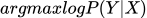

# 六、机器学习基本算法，如分类、回归、聚类、概率模型

 <https://github.com/GYee/CV_interviews_Q-A>

## 归一化和标准化的区别：

归一化：(x-min)/(max-min)，保留了数据中的权重信息

标准化：（x-均值)/方差，保留了数据中的距离信息，丢失了权重信息

## 最小二乘参数估计的具体流程

## 最小乘法和极大似然估计的联系

## 为什么要引入正则化

## 加入正则化项的最小二乘参数估计和最大后验估计的关系

## 极大似然估计与最大后验估计的计算（手写公式）

## 从适用任务、模型、基本思想、损失函数、求解算法讲述以下模型：

|                                                                                  | 任务                                                                                                                 | 模型                                                                                                                                                                                                                                                                                                                                                                                                                                                                                                                                                                                                                                                                                                                                                            | 基本思想                                                                                                                                                                                                                                                                                                                                                                                                                                                                                                                                                                                              | 损失函数                                                                                                                                                                                                                                    | 求解算法                                                                                                                            | 概率图                                                                                                         |
|----------------------------------------------------------------------------------|----------------------------------------------------------------------------------------------------------------------|-----------------------------------------------------------------------------------------------------------------------------------------------------------------------------------------------------------------------------------------------------------------------------------------------------------------------------------------------------------------------------------------------------------------------------------------------------------------------------------------------------------------------------------------------------------------------------------------------------------------------------------------------------------------------------------------------------------------------------------------------------------------|-------------------------------------------------------------------------------------------------------------------------------------------------------------------------------------------------------------------------------------------------------------------------------------------------------------------------------------------------------------------------------------------------------------------------------------------------------------------------------------------------------------------------------------------------------------------------------------------------------|---------------------------------------------------------------------------------------------------------------------------------------------------------------------------------------------------------------------------------------------|-------------------------------------------------------------------------------------------------------------------------------------|----------------------------------------------------------------------------------------------------------------|
| 感知机                                                                           | 硬二分类                                                                                                             |                                                                                                                                                                                                                                                                                                                                                                                                                                                                                                                                                                                                                                                                                                          | 最小化被错误分类的样本数                                                                                                                                                                                                                                                                                                                                                                                                                                                                                                                                                                              |                                                                                                                               | SGD                                                                                                                                 |                                                                                                                |
| 线性判别分析                                                                     | 硬二分类                                                                                                             |  寻找分类超平面                                                                                                                                                                                                                                                                                                                                                                                                                                                                                                                                                                                                                                                                                          | 样本集**类内样本**在超平面上的**投影方差足够小；类间样本投影的距离足够大**                                                                                                                                                                                                                                                                                                                                                                                                                                                                                                                            |   投影方向上均值差的平方/协方差矩阵之和                                                                                       | 令损失函数导数为0求w                                                                                                                |                                                                                                                |
| 逻辑回归                                                                         | 软二分类                                                                                                             |                                                                                                                                                                                                                                                                                                                                                                                                                                                                                                                                                                                            | 线性回归外套激活函数+指定分类阈值                                                                                                                                                                                                                                                                                                                                                                                                                                                                                                                                                                     | 极大似然估计 = 最小化交叉熵损失                                                                                                                                                      | 令导数为，求解W                                                                                                                     |                                                                                                                |
| 高斯判别分析                                                                     | 软二分类                                                                                                             | 假设：y服从伯努利分布(0-1分布)，x\|y=1和x\|y=0服从均值不同方差相同的高斯分布                                                                                                                                                                                                                                                                                                                                                                                                                                                                                                                                                                      | (N个样本)基于贝叶斯定理求后验概率                                                                                                                                                                                                                                                                                                                                                                                                                                                                                                                                                                     | 最大后验估计                                                                                                                  | 令偏导数为0分别求解   |                                                                                                                |
| 朴素贝叶斯分类器                                                                 | 软二分类                                                                                                             | 0-1分类假设y服从伯努利分布 多分类假设y服从分类分布  若xj离散，xj服从分类分布 若xj连续，xj服从均值和方差都不同的高斯分布                                                                                                                                                                                                                                                                                                                                                                                                                                                                                                                           | 朴素贝叶斯假设(条件独立性假设)：单个样本的P维特征相互独立                                                                                                                                                                                                                                                                                                                                                                                                                                                                                                                                             | 最大后验估计                                                                                                                                                                                                                                | 令偏导数为0分别求解概率分布中的参数                                                                                                 |                                                         |
| 硬间隔SVM                                                                        | 硬二分类                                                                                                             |    寻找分类超平面                                                                                                                                                                                                                                                                                                                                                                                                                                                                                                                                                                          | 分类正确的前提下，令离超平面最近的点到超平面的距离最小                                                                                                                                                                                                                                                                                                                                                                                                                                                                                                                                                |    为简化计算，可令最小间隔为1，其只是等比缩放值，并不改变超平面的方向 | 1.带约束优化问题转化为无约束优化问题，使用拉格朗日乘子法求解 转化为对偶问题求解 利用K-K-T条件求解                                   |                                                                                                                |
| 软间隔SVM                                                                        | 二分类                                                                                                               | 若分类正确损失值为0，若分类错误，损失值为1-间隔即合页损失                                                                                                                                                                                                                                                                                                                                                                                                                                                                                                                                                                                         | 允许在硬分类的基础上存在一小部分分类错误的样本                                                                                                                                                                                                                                                                                                                                                                                                                                                                                                                                                        |                                                                                                                                                                                      | 1.转化为对偶问题求解 2.利用K-K-T条件求解                                                                                            |                                                                                                                |
| 高斯混合模型GMM                                                                  | 聚类                                                                                                                 | 建模数据分布P(x) 假设样本有K个聚类中心，则整体的概率分布为K个聚类中心高斯概率分布的叠加                                                                                                                                                                                                                                                                                                                                                                                                                                                                                                                                                                                                                  | 引入隐变量z,其分布表示样本x属于每个聚类中心的概率P z\~离散型随机变量 x\|z\~高斯概率分布                                                                                                                                                                                                                                                                                                                                                                                                                                                                                                               |                 | 极大似然估计问题：log内部为连加项且高维高斯分布计算复杂，无法直接令导数为0求解析解 使用EM算法求解                                   |                                                         |
| 隐马尔可夫模型HMM                                                                |                                                                                                                      | 在HMM的基础上引入时间，建模时序序列 满足齐次马尔可夫假设：当前状态的概率只与前一状态有关 满足条件独立性假设：在给定隐变量z的前提下，所有观测变量x条件独立 model： 为隐变量(即t=1时刻)的概率分布，\~**离散概率分布** **A**为不同时刻隐变量z的状态转移矩阵  **B**为当前时刻隐变量z和观测变量x之间的关系   | 1、已知参数，求P(X\|)【前向后向算法】 2、已知似然P(X\|)，估计参数的值【EM算法】 3、已知观测序列，求令P(Z\|X)最大的状态序列 预测即求 滤波即求  |                                                                                                                                                                                                                                             |                                                                                                                                     |  |
| 卡尔曼滤波\\线性动态系统\\线性高斯模型                                           |                                                                                                                      | 隐变量和观测变量均连续且服从高斯分布 不同时刻的状态之间有线性关系 噪声服从高斯分布  其余与HMM相同                                                                                                                                                                                                                                                                                                                                                                                                                                                                                                                                                 |                                                                                                                                                                                                                                                                                                                                                                                                                                                                                                                                                                                                       |                                                                                                                                                                                                                                             |                                                                                                                                     |                                                                                                                |
| 粒子滤波                                                                         |                                                                                                                      | 非线性，非高斯模型，需要通过采样近似的方式求解析解 其余与HMM相同                                                                                                                                                                                                                                                                                                                                                                                                                                                                                                                                                                                                                                                                                                |                                                                                                                                                                                                                                                                                                                                                                                                                                                                                                                                                                                                       |                                                                                                                                                                                                                                             |                                                                                                                                     |                                                                                                                |
| 最大熵模型（**打破条件独立性假设**）和条件随机场（**打破齐次一阶马尔可夫**假设） |                                                               |                                                                                                                                                                                                                                                                                                                                                                                                                                                                                                                                                                                                                                                                                                                                                                 |                                                                                                                                                                                                                                                                                                                                                                                                                                                                                                                                                                                                       |                                                                                                                                                                                                                                             |                                                                                                                                     |                                                                                                                |
| 玻尔兹曼机BM                                                                     | 带隐节点的马尔可夫随机场（无向图） 概率密度函数为指数族分布                                                          |                                                                                                                                                                                                                                                                                                                                                                                                                                                                                                                                                                                                                                                                                                                                                                 |                                                                                                                                                                                                                                                                                                                                                                                                                                                                                                                                                                                                       |                                                                                                                                                                                                                                             |                                                                                                                                     |                                                                                                                |
| 受限玻尔兹曼机RBM                                                                | 限制BM仅在隐变量和观测变量之间存在连接（组内无关，组间相连）  |                                                                                                                                                                                                                                                                                                                                                                                                                                                                                                                                                                                                                                                                                                                                                                 |                                                                                                                                                                                                                                                                                                                                                                                                                                                                                                                                                                                                       |                                                                                                                                                                                                                                             |                                                                                                                                     |                                                                                                                |

## 补充：点到直线的距离公式：

-   距离公式：d=│（Ax₀+By₀+C）/√(A²+B²)│
-   公式描述：公式中的直线方程为Ax+By+C=0，点P的坐标为(X₀，Y₀)。点到直线的距离，即过这一点做目标直线的垂线，由这一点至垂足的距离。

## 主成分分析PCA

概念：将一组可能线性相关的变量通过正交变换变换为一组线性无关（相互正交）的变量，可通过求**最大化新方向上的投影方差**或**最小化重构距离（重后样本和原样本的l2距离）**两个角度实现

前q维主成分的计算方法

-   计算协方差矩阵，对**协方差矩阵进行特征值分解**后对应的**特征向量**的前q维
-   奇异值分解SVD角度：对**中心化(即样本-均值)后的数据执行奇异值分解**的到**特征向量**和特征矩阵
-   若**协方差矩阵为对称阵，则奇异值分解就是特征分解**

## 核技巧/核函数：

定义：能拆分为非线性转换内积的函数

作用：通过**直接求核函数值**可替代求**样本非线性转换函数内积**，从而简化计算

## 核方法：用于解决非线性可分问题

在基础模型中引入非线性转换处理原样本，再使用核技巧简化运算

## EM算法

应用场景：用于解决**具有隐变量的混合模型**的**极大似然估计问题**

迭代求解步骤：

输入：观测数据x，隐变量数据z，联合分布P(x,z) = pzN(x)，条件分布P(z\|x) { = P(x,z)/p(x)}

输出：模型参数

（1）随机确定初始值，开始迭代；

（2）E步：计算期望E表达式

（3）M步：令期望表达式最大得到

（4）重复E步和M步直到收敛

## 谱聚类

Data：

将N个样本建模为带权重的无向图G={V,E}，V=X，E = W = [Wij]

W为**相似度矩阵**或**邻接矩阵**

谱聚类基于图划分的思想实现，假设划分为k个类别，谱聚类目标=找到令类间相似度最小的划分序列【组合优化问题】

为消除划分中不同节点数量的影响，引入归一化因子

, dig为集合Ak中所有每个节点权重和之和

