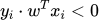
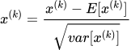
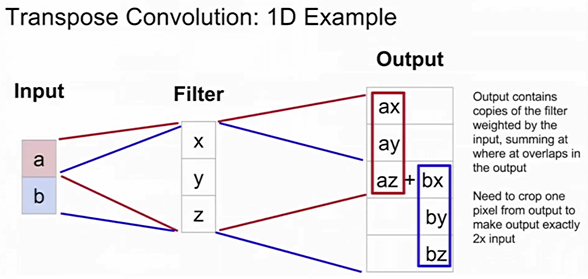
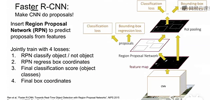
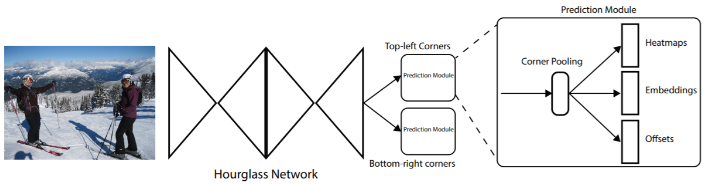
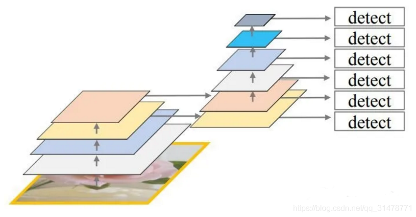
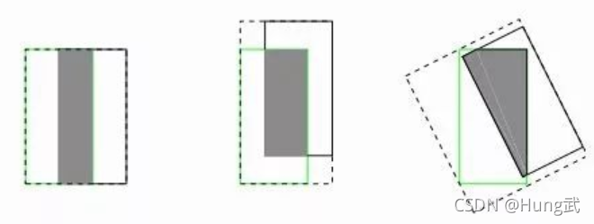
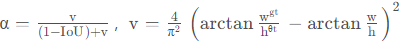

# 四、深度学习-Pytorch-理论

## 深度学习方法概述：分类、聚类、回归和降维

## 使用Pytorch构建DeepLearning算法的基本流程：

以线性模型为例：

Part1：DataSet-数据集准备

Part2：Model-模型选择：线性模型 y = w\*x+b

Part3：Training-训练模型

-   随机初始化w；
-   定义优化器
-   定义评估函数loss func：计算每一个样本点预测值和真实值之间的差值(y_het(i)-y(i) )\^2；
-   改变w取值 —\> 最小化所有样本的平均损失cost func：MSE-平均平方误差 (穷举法：计算所有有可能的权重值对应的cost func值)

part4：inferring-确定权重后将model用于推理or预测

## 损失函数、目标函数、价值函数概念

损失函数：单个样本的损失

价值函数：所有样本损失和的平均值

目标函数：minxxx或maxxxx整体称作目标函数

## 权重W初始化策略

### Q：初始化权重值过小会怎样？

答：梯度值下降会非常缓慢

### Q：初始化权重值过大会怎样？

答：会导致梯度下降过快，错过最优解

### Q：初始化所有权重值W=0会怎样？

答：会导致所有神经元都相同

### Q：正确的权重初始化策略有哪些？

1.  **初始化w=小的随机数，适用于小型网络**

假设：使用 W = 1\* np.random.randn(D,H)，tanh激活函数会出现什么情况？

答：网络饱和。解释，权重W较大，使得输出较大，输入tanh后，输出值接近1或-1。

2.  **w从标准高斯分布中取样，然后依据输入数据的数量进行缩放**

## 梯度下降、随机梯度下降、mini-batch梯度下降、动量方法、Adagrad、Adam（优化算法）

**梯度下降（性能低，时间复杂度低）**：计算**价值函数的梯度**，下降方向：负梯度方向，步长大小：学习率；可并行计算各个样本点的梯度；能找到凸函数的全局最优，非凸函数的局部最优，无法解决深度学习中的鞍点问题

**随机梯度下降（性能高，时间复杂度高）：随机选某个样本的损失函数**的负梯度为下降方向更新权重；有**山谷震荡和鞍点问题**；无法并行计算

**mini-batch梯度下降（折中）：将样本分为若干组，每次计算一组样本损失和的梯度**

**动量方法：随机梯度下降 + 惯性**，下降方向 = **带衰减的前一次的下降方向** + 学习率 \* 当前算出的梯度

**Adagrad: 随机梯度下降 + 变化的学习速率**，下降方向 = （学习率/sqrt(历史梯度的平方和)）\* 当前计算出的梯度

缺陷：梯度平方项逐渐增大，会导致梯度下降步长（学习率）越来越小

适用于凸函数，不适用非凸函数（会被困于局部极值点）

**RMSProp**：

**Adam：随机梯度+惯性+变化的学习率**，下降方向 = **学习率/sqrt(过往梯度平方和当前梯度平方的平均值) \* 过往梯度与当前梯度的平均值**

## 手推前馈运算和反向传播

1.  首先绘制计算图；2、前馈计算得到loss func的值；3、基于计算图，计算局部偏导数；4、依据链式法则得到最终结果
-   **加法节点**：梯度直接赋值给前面的多个分支
-   **max节点**：梯度回传给其中一个分支，另一个分支梯度为0

解释：在前向传播中，只有最大值能够被不断向后传递

-   **倍乘节点**：回传梯度值进行缩放
-   **一个节点向后连接到多个节点**：多个节点的梯度值相加，回传到上游节点

## 回归问题与分类问题的联系（以逻辑回归到二分类为例）：

在模型外**套用激活函数将回归的预测值映射为（0，1）之间的概率值**，设置一个分类阈值将，高于阈值判定为0类，低于判定为1类。

## 机器学习的本质：

**学习数据数据分布**，预测值服从一个概率分布，标签值也服从一个概率分布，利用分布之间的差异作为损失函数计算梯度更新权重值。

## 常见的激活函数公式及图像：Sigmoid、tanh、ReLU，分析优缺点

, ，当z很大或很小时，激活函数的梯度趋于0（**梯度消失**现象）；sigmoid不关于0点堆成，会导致所得梯度恒正或恒负；指数函数的计算代价大

，**优点**：计算复杂度低；能解决梯度消失，同时单侧抑制提供了网络的稀疏表达能力；**缺点**：Z小于0的部分梯度为0，在训练过程中会导致神经元死亡；改进：提出Leaky ReLU（LReLU），使用斜率为a的线性函数（az）替代0

**ELU**：建立负饱和机制，使得激活函数对噪音有更好的鲁棒性

**Maxout**：将参数数量翻倍，训练两个权重组合，选取其中最大的一个作为最终结果

## 二分类问题常用的损失函数：0-1损失、Hinge(合页损失)、交叉熵损失

**模型**：y = wx+b，设置正确的标签为1，错误的标签为-1，以0为阈值划分将预测值划分至指定的类别

### 0-1损失:（错误驱动）

**原理：**价值函数 = 预测错误的负样本个数

**解释：,**其中wx为预测值，y为标签wx\>0即预测为正样本+标签=1 或 wx\<0即预测为负样本+标签=-1，则说明预测正确，乘积\>0; 若预测错误，则乘积\<0 ，满足条件，则指示函数会将错误样本计数。

**缺点：**指示函数不可导，无法优化

### Hinge Loss：去掉0-1损失中的指示函数，直接使用统计错误样本

****

### 交叉熵损失：基于极大似然的思想，采用对数似然损失（BCE损失即二分类交叉熵）推导如下

## 多分类问题的两种解决方案

1.  **将多分类问题拆解为多个独立的二分类问题，将模型输出由一个直接变为多个，每个输出代表样本属于某一个类别的概率**。缺陷：无法建模输出结果之间的关系：某个样本只可能属于一个类别
2.  约束输出的预测值服从某个和为1的概率分布 - 即**在预测值上套用Softmax函数**

-   使用e的幂次 —\> 保证每个输出都≥ 0
-   除所有求和项 —\> 输出求和为1

## 多分类问题的两种损失函数：多分类SVM损失、Softmax损失(多分类逻辑回归)

### 多分类SVM损失函数（支持向量机）：

模型：score = Wx+b，**多个二分类线性模型堆叠**，分别输出样本属于某个类别的得分

单个样本(cost loss)：**循环比较正确分类的分数和错误分类的分数，若分数差值大于阈值（设置为1），设置当前样本损失 = 0，否则损失 = 错误分类的分数-正确分类的分数+1**

总损失 = 所有样本损失之和

第一个样本(猫的图片)：Li = max(0，5.1-3.2+1)+max(0，-1.7-3.2+1) = max(0，-2.9)+max(0，-3.9) = 2.9+0 = 2.9

解释：3.2≧5.1+1（不成立）---\>L = 5.1-3.2+1；3.2≧-1.7+1（成立）---\> L = 0；将所有分类的损失相加，即为该样本最终损失函数Li

第二个样本(车的图片)：Li = max(0，1.3-4.9+1)+max(0，2.0-4.9+1) = max(0，-2.6)+max(0，-1.9) = 0+0 = 0

第三个样本(青蛙的图片)：Li = max(0，2.2-(-3.1)+1)+max(0，2.5-(-3.1)+1) = max(0，6.3)+max(0，6.6) = 6.3+6.6 = 12.9

总的损失函数 L = （2.9+0+12.9）/3 = 5.27

-   **Q1:第二个样本，如果改变汽车的得分，损失函数会发生什么变化？**

答：SVM loss关注点为正确的分数比错误的分数大，当正确的分数比错误的分数大过安全边界时，正确分数微小发生改变不会影响损失函数的值（仍为0）

-   **Q2:为什么安全边距选择为1？**

答：安全边距是一个可以任意选择的值，在缩放操作中会被消除

-   **Q3:SVM损失函数可能的最大值和最小值是多少？**

答：0和无穷大

-   **Q4:初始化参数**，并且从头开始训练，通常会使用一些很小的随机值来初始化W，则分数在训练初期会接近0，并且差不多相等，即S≈0。那么损失函数的值为多少？

答：L = 分类的数量C - 1；应用：在第一次迭代时检查损失函数的值，如果不等于C-1，则可能存在bug

-   **Q5：如果对所有分类求和会发生什么（包括j = yi）？**

答：损失函数会+1；解释：若j = yi，则Syi ≧ Sj + 1不成立。Li = Sj - Syi + 1 = 1

-   **Q6:如果使用平均值代替公式中的求和，损失函数会发生什么变化？**

答：损失函数不会改变，只是缩放了一定的倍数。

-   **Q7:如果使用分数差值+1的平方作为损失函数呢？**

答：这是一个不同的分类算法（损失函数），平方会增大错误对损失的影响，一个非常不好的错误会使损失值增大很多

-   **Q8:假设 L = 0 即完美拟合训练集，能满足该条件的W不唯一**。W，2W，W/2（对W进行缩放操作），均可以使得 L = 0

### Softmax损失(多分类逻辑回归)

模型：score = Softmax(Wx+b)，多个二分类线性模型堆叠，分别输出样本属于某个类别的得分，使用softmax约束输出的预测值服从某个和为1的概率分布

loss function：使计算所得的概率分布与趋近于真实的概率分布。

1.  计算交叉熵损失
2.  使计算所得的概率分布与趋近于真实的概率分布。
3.  计算极大似然估计
-   **Q1:Softmax loss的最大值和最小值分别是多少？**

答：最小值是0；最大值是无穷大。解释，当概率接近于1时-log函数值趋向于0。当概率趋向于0时，-log趋向于无穷。

-   **Q2：初始化参数，并且从头开始训练，通常会使用一些很小的随机值来初始化W，则分数在训练初期会接近0，并且差不多相等，即S≈0。那么损失函数的值为多少**？ 纠错机制 L = ln（C），C为类别数量

## 回归问题常用的损失函数：平方损失、绝对值损失

**注：平方损失和绝对值损失在分类问题上表现非凸，因此不用于解决分类问题**

-   **平方损失**：loss = （预测值-真实值）\^2，预测值距离真实值越远，惩罚的力度越大，因此对异常点敏感
-   **绝对值损失**：loss = ｜预测值-真实值｜，优点：对异常值更鲁棒

## 聚类问题常用的损失函数：各个样本到所属簇中心的误差平方和

## 回归问题的性能评价指标：平均绝对误差MAE（mean absolute error）、均方根误差 RMSE（root mean squared error)、平均绝对百分比误差（MAPE）

- **平均绝对误差**：N个样本预测值和真实值之间差距的绝对值的平均

- **均方根误差：**预测值和实际观测之间平方差异平均值的平方根**（缺点：离群点敏感）**

- **平均绝对百分比误差（MAPE）**：把每个点误差归一化，降低个别离群点带来的误差影响

## 分类问题的性能评价指标：准确率、精确率、召回率、P-R曲线、F1-score、ROC、AUC

-   **准确率(Accuracy)** = **分类正确的样本数**/**总样本数**（不适用于样本比列不均匀的情况）
-   **精确率**=**分类正确的正样本数**/**分类器判定为正样本的样本数**
-   **召回率**=**分类正确的正样本数/真正的正样本数**
-   **P-R曲线：纵轴精确率，横轴召回率，评价排序问题需计算top-N下的精确率和召回率，生成P-R曲线**
-   **AP：P-R曲线下的面积**

    **计算方法1：设定阈值计算**。首先设定一组阈值，[0, 0.1, 0.2, …,1]。对于recall大于每一个阈值（比如recall\>0.3）都会得到一个对应的最大precision。AP=11个precision的平均值

    **计算方法2：使用插值法简化计算**

    ****

-   **F1 score = ，是精确率和召回率的调和平均值**
-   **ROC：纵轴为TPR(Ture Positive rate, 真阳率，即将正样本预测为正样本的比例)横轴为FPR(False Positive Rate, 假正样本率，即将负样本被预测为正样本的比例)；一般分类器会输出预测样本为正样本的概率，设定一个阈值，大于该阈值，则判定为正样本，否则为负样本，通过移动该阈值计算每个阈值下的真阳和假阳率形成ROC曲线**
-   **AUC：ROC曲线下方的面积，一般AUC越大，分类性能越好**

## ROC曲线相较于P-R曲线的优点：

**当正负样本分布发生变化是，ROC曲线的形状能基本保持不变，而P-R曲线会发生较大的变化**

## P-R曲线比ROC曲线更适用于类别不平衡数据的评估

类别不平衡问题概述：**正例样本量少，负例样本量多，**当正负样本比例超过1:3，分类器就已经会倾向于负样本的判断**（表现在负样本Recall过高，而正样本 Recall 低，而整体的 Accuracy依然会有很好的表现）**。

**P-R曲线的横纵两个坐标都关注于正例，类别不平衡问题也更关注于正例**

## 如何解决机器学习中样本不均衡问题

1.  **欠采样（下采样）**：去除训练集内的多数样本，使得两类样本数量级接近
    1.  **随机丢弃样本**。缺点：可能丢失多数类的重要信息
    2.  **欠采样算法-EasyEnsemble**： 利用集成学习机制，它将多数样本划分成若 N个集合，然后将划分过后的集合与少数样本组合，这样就形成了N个训练集合，而且每个训练集合都进行了欠采样，但从全局来看却没有信息丢失。
2.  **过采样（上采样）**：对训练集内的少数样本进行扩充
    1.  **直接复制少数样本**。缺点：只增加了数据数量，但没有给少数样本中添加新的信息，容易过拟合
    2.  **通过抽样方法在少数类样本中加入白噪声（比如高斯噪声）变成新样本**一定程度上可以缓解这个问题。如年龄，原年龄=新年龄+random（0,1）
    3.  **SMOTE算法：通过对少数样本进行插值来获取新样本**，比如对于每个少数类样本a，从a最邻近的样本中选取样本b，然后在对ab 中随机选择一点作为新样本。
    4.  **阈值移动**：将关注点从**样本集合的再平衡**移向**算法决策过程**的改进。通常我们对预测结果进行分类时，当预测y（y 代表正类可能性） 值＞0.5时，判定预测结果为正，反之为负。此时规定决策规则为：
        
    5.  **ADASYN算法（自适应综合过采样）**：根据学习难度的不同，对不同的少数类别的样本使用加权分布，比较容易学习的少数类样本，对于难以学习的少数类的样本，产生更多的综合数据。 因此，ADASYN方法通过两种方式改善了对数据分布的学习：（1）减少类不平衡引入的偏差，（2）将分类决策边界自适应地转移到困难的样本。
3.  **对分类任务中不同样本数量的类别赋予不同的权重**（一般小样本量类别权重高，大样本量类别权重低）
4.  **使用组成/集合方法**：在每次生成训练集时使用所有分类中的小样本量，同时从分类中的大样本量中随机抽取数据来与小样本量合并构成训练集，这样反复多次会得到很多训练集和训练模型。最后在应用时，使用组合方法（例如投票、加权投票等）产生分类预测结果。
5.  **尝试不同的分类算法**
6.  将正负样本极不平衡的场景**看作一分类或异常检测检测问题**，重点不在于捕捉类间的差别，而是为其中一类进行建模，只需要判断是或不是某个类别即可无需区分负样本所属的类别
7.  对具有**大量样本的丰富类进行聚类操作，使用聚类中心作为负样本的代表**。假设我们使用的方法是 K-Means聚类算法 。此时，我们可以选择K值为稀有类中的数据样本的个数，并将聚类后的中心点以及相应的聚类中心当做富类样本的代表样例，类标与富类类标一致。经过聚类操作，我们对富类训练样本进行了筛选，接下来我们就可以将相等样本数的K个正负样本进行有监督训练。

## 数据集不平衡时该如何选择欠采样和过采样

（1） 考虑对**大类**下的样本（超过1万、十万甚至更多）进行**欠采样**，即删除部分样本；

（2） 考虑对**小类**下的样本（不足1为甚至更少）进行**过采样**，即添加部分样本的副本；

（3）使用过采样方法来解决不平衡问题时应适当地应用交叉验证。

这是因为过采样会观察到罕见的样本，并根据分布函数应用自举生成新的随机数据，如果在过采样之后应用交叉验证，那么我们所做的就是将我们的模型过拟合于一个特定的人工引导结果。这就是为什么在过度采样数据之前应该始终进行交叉验证，就像实现特征选择一样。只有重复采样数据可以将随机性引入到数据集中，以确保不会出现过拟合问题。

（4）考虑尝试随机采样与非随机采样两种采样方法；

（5）考虑对各类别尝试不同的采样比例，不一定是1:1，有时候1:1反而不好，因为与现实情况相差甚远；

（6）考虑同时使用过采样与欠采样，对二者进行结合

## 样本不均衡问题的评价指标：召回率(Recall）、精确率(Precision)和综合评价指标(F-Mmeasure)、P-R曲线

当少数类的召回率、精确率和综合评价指标较高时，说明没有漏检，查的比较全且精确度比较高。

对于反例\>\>正例时，下采样预测模型会存在以下问题：Recall值虽然达到标准，但容易出现过检的情况，即将正品预测为次品，FP值过大，精确率低。而对于过采样来说，虽然Recall值略低于下采样，但能够有效降低过检出现的次数，既保证了召回率又保证了精确率。因此，建议使用过采样来训练模型。

## 解决过拟合的方法：

1.  **增加数据量**：图像水平翻转、裁剪、随机改变对比度、宽度、色彩抖动等等
2.  **降维**：特征选择或特征提取
3.  降低模型复杂度
4.  **正则化**：对损失函数添加约束项（即给模型参数添加约束项）
5.  集成学习（Dropout（**多个网络共享参数**）也可看作一种特殊的集成学习）：集合多个模型降低过拟合的风险（**多个模型相互独立**）

## 解决欠拟合：

1.  增加特征
2.  增加模型复杂度
3.  减小正则化系数

## 正则化项定义：

在损失函数中增加正则项（Regularization），使得分类器倾向于选择更简单的W（即减少参数或降低模型阶数）来降低模型复杂度；若**变量比较多，多项式比较多**就需要使用正则化

**超参数lammed**：用于平衡数据损失项和正则化项的占比

## 正则化项的种类（正则化策略）

设 

-   **L2 regularization**：,k为类别标签数量，l为一张图片中包含的像素点总数（单个样本特征向量长度）

**特征：倾向于选择密集（均衡权重值）的W矩阵**（eg：W2 = [0.25,0.25,0.25,0.25]）尽可能的将所有变量x的影响纳入损失函数中。

-   **L1 regularization**：  

**特征：倾向于选择稀疏的W矩阵**（eg：W1 = [1,0,0,0]）重视某一个变量x对损失函数的影响。

-   **Elastic net（L1+L2）**：
-   **Max norm regularization**
-   **Dropout随机失活：训练阶段**随机将一部分神经元（激活函数）置0；测试阶段使用全部神经元，相当于之前训练的不同结构网络都参与对最终结果的投票，以取得较好的效果

    适用：一般用于全连接层，在卷积层中，通常会将某一个通道全部置0

    作用：抑制过拟合

-   **Fancier**：Batch normalization stochastic dopth
-   **Batch Normalization**
-   **随机深度（Stochastic）**：在训练时随机跳过一些层
-   **部分最大池化**
-   **Dropconnected**：随机将权重矩阵中的\*\*一部分权重值\*\*置0

## 模型评估的方法：Holdout、K-fold交叉验证、留1/留p验证、自助采样法

**Holdout**：将数据集随机划分为训练集和验证集，训练集用于训练，验证集用于计算评价指标

缺点：计算出的评估指标有**随机性**，受原始分组方式影响较大

**K-fold交叉验证**：将全部样本划分为K个大小相同的子集，依次使用每个子集作为验证集，其他所有子集作为训练集进行模型的训练与评估，最后取评估指标的平均值

常见k=10

**留1/留p验证**，每次留1个/p个样本作为验证集，其余所有样本作为训练集进行模型训练与评估，执行n次，取评估指标的平均值

缺点：样本数量多的情况下，**时间开销极大**

**自助采样法**：在总数为n的样本中执行n次有放回的抽样，以没有被抽过的样本为验证集计算性能评价指标。

优点：适用于**小数据集**；当样本数很大时，大约有36.8%的数据未被选择过

## epoch和iteration的区别

**epoch：所有训练样本**都执行完成一次前向传播、反向传播及更新

**iteration：单个batch中的样本**执行完成一次前向传播、反向传播及更新

## Dataset数据类与DataLoader数据类

-   Dataset数据类 - 构造数据集，支持索引
    -   抽象类，不能实例化，只能由子类继承，从而构造自定义的Dataset类
    -   子类中要实现的方法： **init**(self, filepath): 2种实现方式 在这里加载所有的数据到内存（适用于数据量小的情况）；
        -   定义一些初始化，存放每条数据的文件名到内存，使用时再读取 （适用于数据量大-图像等）；
        -   **getitem**(self, index): 使得对象下标索引可用，通过对象下标取出数据集中的某一条数据 在这个函数中实现数据预处理操作，dataloader在通过index载入数据时，会执行这个函数下的全部代码
            -   数据预处理操作举例：图像增强，分子SMILES转化分子图，图神经网络数据构图等
        -   **len**(self): 使得len()函数可以返回数据条数
-   DataLoader数据类 - 取mini-batch
    -   可实例化，初始化至少要传递以下参数 dataset: 数据集对象
        -   batch_size
        -   shuffle: 是否打乱数据，True or False
        -   num_workers: 要几个并行的进程同时读取样本（与cpu核心数量有关）
        -   collate_fn: 合并样本list以形成一个mini-batch tensor
        -   drop_last: Ture/False 是否删除最后一个不完整的批次
    -   加载数据：切分batch
    -   处理数据：shuffle - 随机打乱

## 训练过程的监控方法：

### 1、完整性检查操作

-   数据预处理
-   选择网络结构
-   初始化网络，网络前向传播，需要确定最终的损失函数是合理的
-   训练神经网络：从一个小的数据集开始；关闭正则化项，在每一个epoch计算损失，观察损失是否降为0。

### 2、开始正式训练神经网络

-   使用全部的训练数据训练，加入一个小的正则化项，确定合适的学习率

    学习率过低：损失基本没有变化（\<1e-3）

    学习率过高：cost值为NaNs（1e-6）

    正常学习率范围：[1e-3,1e-5]

**Q1:在学习率过低，损失基本没有变化的情况下，训练集和验证集的准确率都非常快的上升到了20%，为什么？**

答：权重在向着正确的方向发生轻微的改变，我们正在选取最大的准确率，所以准确率会有一个突变。

#### 训练过程中的超参数优化策略

**策略**：对所有超参数进行交叉验证

**步骤**：

-   选择相当分散的数值，用几个epoch的迭代去学习
-   经过几个epoch，可以确定超参数的哪些值好，哪些值不好

eg：若输出cost \> 3\*初始cost值，可以停止迭代，因为cost会迅速变大直到NaNs

通过观察损失曲线，可确定学习率是否合适

-   确定超参数范围
-   采用对数函数来优化会取得更好的效果

如何对不同的超参数进行采样：随机采样 VS 网格采样

## --梯度消失问题：

梯度反向传播的过程中，后层的梯度以连乘的方式叠加到前层，而常用的sigmoid等激活函数具有饱和性，当输入达到一定值的情况下，其梯度趋向于0，且后层梯度本身就比较小，梯度误差反传至前层时几乎会衰减为0，因此无法有效学习前层的参数

## 梯度消失问题的解决方案：

1、**线性模型中的梯度消失问题** - 解决方案：**逐层训练**

eg：1、2层线性模型+单层分类层 训练；2、锁定前两层参数，加入第三层线性层，即3层线性模型+单层分类器 训练… 。通过**一层层添加线性层并针对性训练**的方式解决梯度消失问题

2、**深度学习模型中的梯度消失问题** - 解决方案：**Residual-残差连接**；**循环神经网络LSTM**（在RNN基础上添加一条数据通路）

## nn.functional中的函数和nn.Module主要区别

function**定义的激活函数**等**不需要学习和参数更新**。激活函数（ReLU,sigmoid,tanh），池化等可以使用functional替代。

module**一般定义层，参数需要更新，**对于卷积，全连接等具有可学习参数的网络建议使用nn.Module

## train和eval区别

模型有BN，train保证BN用**每一批数据**的均值和方差

eval保证用**全部训练数据**的均值和方差

有dropout，train保证**使用**

eval保证**不使用**

**两者都有梯度计算，但eval不作反向传播**，使用with torch.no_grad可以加速时间及节省 GPU使用

## GPU与CPU的使用

CPU和GPU都是一种通用计算器，可以在上面执行程序和任意指令

### GPU编码语言：

-   CUDA：（只能在NVIDIA GPU上运行）

    1、允许编写类C语言的代码，可以直接在GPU上运行

    2、提供高一级的API

    1\. cuBLAS：实现各种各样的矩阵乘法

    2\. cuFFT： 实现类似卷积，前向传播、反向传播、批归一化，递归神经网络等等。

    3\. cuDNN

-   OpenCL（能运行于NVIDIA GPU、AMD以及CPU）

### CPU和GPU之间的数据交换

eg:模型的权重存储在GPU上，庞大的数据集存储在机械硬盘或固态硬盘。

问题：从硬盘中串行读取数据的速度非常慢，会成为训练的瓶颈

-   解决方式1：将数据提前读入内存
-   解决方式2:在CPU上适用多线程\***批量多次的\***\***读取数据\***存储到内存之中

注：Numpy只能在CPU上运行

## RNN、LSTM、GRU：

<https://blog.csdn.net/sinat_28015305/article/details/109355828>

### 循环神经网络的应用场景

处理**序列数据/链状数据**（传统使用隐马尔可夫和条件随机场等模型处理）

### RNN

设输入的序列数据为,可按照时间步t展开RNN网络(类似于前馈神经网络)，每层包含**输入状态x、隐藏状态h和输出状态o，**Loss为**所有时刻的损失之和，每个时刻的重复结构共享权重参数**

-   **输入状态：**
-   **隐藏状态：当前输入+ t-1时刻的隐藏状态的线性组合 **
-   **输出状态：仅与当前时刻隐状态有关 **
-   ****

**RNN反向传播（即基于时间的反向传播算法）**

**求**

**其中是一个基于时间t递推式，无法并行计算**

### LSTM

未解决RNN中不同时刻隐藏状态单元共享参数W，导致的梯度消失/爆炸问题，LSTM添加**元胞状态（cell state）c，其在不同时刻有可变的连接权重**

**当前状态：**

**门控变量 = 当前输入+ t-1时刻的隐藏状态的线性组合（全连接层）**，计算方式相同，仅权重矩阵和偏置向量不同，常用激活函数为sigmoid, 使用**门控单元x数据实现数据通过量的控制**

-   **输入门 **
-   **遗忘门**
-   **输出门**

**状态变量的转换：遗忘们和输出门的激活函数非常重要**

-   **输入状态：**
-   **输入预处理：当前输入+ t-1时刻的隐藏状态的线性组合**
-   **使用门操作控制上一时刻的数据和当前输入的比例 **
-   **隐藏状态：输出门乘融合后的元胞状态 **
-   **输出状态：仅与当前时刻隐状态有关** 

### GRU: 简化LSTM，减少参数量，提高计算效率，重置门r和更新门z

## 如何将序列数据建模为网格型数据

1.  建模为二维网格型数据：分别提取每个单词的M维向量，整个句子就构成尺寸为为NxM的二维矩阵
2.  基于时间轴建模为一维网格数据，使用**因果卷积（利用1\~t-1时刻的数据）、空洞卷积**处理

## Dropout如何用于循环神经网络

循环神经网络连接分为**循环连接**（t时刻到t+1时刻的连接）和**前馈连接**（t时刻输入到输出的连接），通常**将Dropout用于前馈连接中丢弃连接**

1.  对于同一个序列在所有时刻的循环连接上采用相同的丢弃方法
2.  使用之前时间步上的激活值代替置0

## 循环神经网络中的长期依赖问题：t增大，循环重复结构导致梯度消失/爆炸问题

**解释：**基于时间的反向传播计算中包含一个基于时间t的递推式 + 不同隐层状态共享权重W + 使用ReLU激活函数且取值大于0 = 因此计算式中存在权重矩阵W的幂次项，累乘会使得最终的结果趋于0（梯度消失）或趋于1（梯度爆炸）

**解决方案：**

-   选择合适的初始化权值、激活函数、加入正则化项；
-   在时间维度上添加跳连；
-   使用LSTM、GRU等

## CNN

### 卷积层的应用场景：

处理网格类结构数据，能更好的保留**输入图片的空间结构**，适用于具有**局部空间相关性的数据**，比如**图像，自然语言，语音**

-   分类检测识别：图像检索、目标识别、图像分割、人脸识别、视频分类、姿势识别、游戏增强学习、医学图像解析和诊断。
-   图像描述：为图像输出描述性语句。
-   风格图片合成。

### 介绍下卷积操作的作用

卷积核参数是通过网络训练所得，通过**不同的卷积核的组合**可提取**获取图像区域不同类型特征**；浅层的卷积核可学到**图像特征的一般模式**，网络层数逐渐加深，前一层的输出作为后一层的输入，简单模式会被组合成**高层特征**。

### 卷积核的工作过程：

-   将图片对应的5 \**5 \**3 区域内像素点拉伸为一维向量
-   将5 \**5 \**3卷积核拉伸为一维向量
-   最终结果 = 对应位置像素点的值与权重值相乘后求和+偏置b

### 卷积相关计算：卷积层参数数量、输出特征图大小

### 卷积层参数数量 = 卷积核尺寸 x 前一层特征图通道数 x 当前层卷积核数量 + 卷积核数量

假设输入层矩阵维度是3，第一层卷积层使用尺寸为5 ∗ 5、深度为16的过滤器（卷积核尺寸为5 ∗ 5、卷积核数量为16），这层卷积层的参数个数为5 ∗ 5 ∗ 3 ∗ 16 + 16 = 1216 个

### 输出特征图大小

图像没有填充：输出大小（维度）（图片大小 - 卷积核大小）/ stride + 1

图像有填充：输出大小（维度）= （图片大小 + pad \* 2 - 卷积核大小）/ stride + 1

### 输出通道数 = 卷积核数

### 各i层感受野的大小 = 第i-1层感受野大小+(当前层卷积核大小-1)x 0 - i-1层步长之和

### 常见的填充方式

-   **SAME填充方式**：填充像素。conv2d函数常用。
-   **VALID填充方式**：不填充像素，Maxpooling2D函数常用。"SAME"卷积方式，对于输入5x5图像，图像的每一个点都作为卷积核的中心。最后得到5x5的结果，通俗的来说：首先在原图外层补一圈0，将原图的第一点作为卷积核中心，若一圈0不够，继续补一圈0。

### CNN结构特点：局部连接(稀疏交互)，权值共享(参数共享)，池化操作，多层次结构。

-   **局部连接：卷积核使得单个输出神经元只与前一层特定区域神经元存在连接，**使网络可以**提取数据的局部特征**
-   **权值共享**大大**降低了网络的训练难度**，使卷积层具有**平移等变性**
-   **池化操作与多层次结构**一起，**实现了数据的降维**，将低层次的局部特征组合成为较高层次的特征，从而对整个图片进行表示。

### 什么是感受野

**后一层**神经元在**前一层**神经元的**感受空间**；

**小卷积核（如3\*3）通过多层叠加可取得与大卷积核（如7\*7）同等规模的感受野**

### 采用小卷积核的两个优势：

1、**小卷积核需多层叠加**，**加深了网络深度**进而**增强了网络容量**(model capacity)和**复杂度**（model complexity）

1.  增强了网络容量的同时**减少了参数个数**。

### 池化的定义：对图像进行缩放来减少参数数量（和滑动卷积核进行点积运算有类似效果），池化层的输入不做填充

### pooling层作用

-   **保持特征平移、伸缩、旋转不变性**。
    -   平移不变性：图像的微小平移，不影响池化结果；
    -   由于池化取邻域的最大值，图像的缩放大概率不影响池化结果；
    -   对于旋转角度的图像，总有一个对应的卷积核学习到该特征，该特征会在最大池化中被保留
-   **减小特征图大小**。汇合层对空间局部区域进行下采样，使下一层需要的参数量和计算量减少，并降低过拟合风险。
-   **最大汇合可以带来非线性**。这是目前最大汇合更常用的原因之一。

### 常用的池化方法（降采样）：

-   **MAX Pooling**：提取卷积核覆盖区域中像素点的最大值；**特点：更好的提取纹理信息**

    常用设置：2\*2 filters and stride 2｜3 \* 3 filters and stride 2，通常使得卷积区域之间没有重叠

-   **均值池化**：计算卷积核覆盖区域中像素点的平均值；**特点：对背景的保留效果较好**
-   **相邻重叠区域池化**，即滑动步长小于池化窗口宽度
-   **金字塔池化**：同时计算1x1,2x2,4x4的矩阵池化，并将结果拼接作为下一网络层的输入

### 卷积层和池化层的区别

1. 卷积层**有参数**，池化层没有参数

2.  经过卷积层节点**矩阵深度会改变**，池化层不会改变节点矩阵的深度，但是它可以缩小节点矩阵的大小。

### 去池化（上采样）：用于找回在池化过程中丢失的部分信息

### BN(批量归一化)层的基本动机和原理

BN层约束输入特征**均值为0，方差为1**。设输入特征维度为k，对每个特征维度独立计算经验均值和方差；然后对数据执行归一化操作

****

神经网络训练的本质是**学习数据分布**

BN层放于**全连接层、卷积层之后，激活层之前**，**将所有批数据强制在统一的数据分布**之下，**降低因数据分布变化导致的训练高复杂度和过拟合风险**

### 分组卷积：

普通卷积：卷积核通道数 = 输入图片通道数

分组卷积：将输入图片通道和卷积核通道分为多组，依据组号使用对应的卷积核进行卷积

作用：使用分组卷积可将计算和存储分配至多个GPU上，常被用于构建用于移动设备的小型网络模型

缺点：理论上可显著降低计算量，但由于对内存的频繁访问并未降低，且现有的GPU加速库对其优化有限，因此在效率上的提升不如理论显著

### 转置卷积（Transpose Convolution）

3x3的卷积转置：取特征值的输入值，乘以卷积核，以3\*3的区域复制这些值

作用：对特征图进行扩张或上采样

-   语义分割、实例分割等任务：先聚合图像特征提取高层语义，再使用转置卷积扩张高层语义特征图，输出与原图像一致的像素级分割结果
-   部分物体检测、关键点检测需要输出与原图像大小一致的热图
-   用于图像自编码器、变分自编码器、生成对抗网络等

### 空洞卷积：

在标准卷积核中添加空洞，扩大卷积核尺寸，不经过下采样即可扩大感受野，同时保留数据的内部结构

扩张率为r的空洞卷积，卷积核上相邻数据点之间有r-1个空洞

### 可变形卷积

可变形卷积**在卷积核的每个采样点上添加一个可学习的偏移量**，让采样点不再局限于规则的网格点，使**卷积核可学习到物体在不同图片中出现的复杂几何形变**

空洞卷积是一种特殊的可形变卷积

1.  平行分支线先依据特征图计算采样点的偏移量；
2.  依据偏移量在输入特征图上采样对应的点进行卷积运算
3.  计算出的偏移量不再网格点上时使用双线性插值计算正确的采样位置

### CNN是什么，CNN关键的层有哪些？

CNN是卷积神经网络，其关键层有：

① **输入层**，对数据去均值，做data augmentation等工作

② **卷积层**，局部关联抽取feature

③ **激活层**，非线性变化

④ **池化层**，下采样，即取区域平均或最大

⑤ **全连接层**，增加模型非线性

⑥ **高速通道**，快速连接

⑦ **BN层**，缓解梯度弥散

## CV基本任务概念区分：

-   **语义分割** ---\> **没有对象**的概念，只是像素点，输入图像，依据已知的类别，将图像中**每一个像素点**划分进相应的类别
-   **分类和定位** ---\>  **单个对象**，对图片进行分类（eg：判断图片中的对象是猫），并使用边界框圈出该对象。
-   **目标检测** ---\>  **多个对象**，给定几个固定的类别（猫、狗），然后依据输入的图像，每当在图像中出现给定类的对象时，围绕该对象绘制标记框，并预测该对象所属的类别
-   **实例分割** ---\> **多个对象**，确定输入图像的哪些像素对应着预测物体，标记出属于不同对象的像素点。

## 图像分类

已知输入图像和标签，分类器提取图片特征，全连接层预测图片可能属于每一个分类标签的概率

### 图像分类任务面临的问题和挑战

1、**Semantic Gap（语义鸿沟）**：图片所表达的语义和计算机实际看到的像素值之间的巨大差异

1.  算法对于以下问题应该具有**鲁棒性（Robust）**：Viewpoint variation（**相机移动**等因素）、IIIumination（**不同的照明条件**）、Deformation（**形变-不同的姿势**）、Occlusion（**遮挡**）、Background Clutter（**目标对象颜色和背景相似**）、Intraclass variation（**类内差异-不同大小、种类、形状 的猫**）。

### 图像分类现有的方法类别：

**方法一：写一些硬性的分类规则：**

图片-------(找到边缘)-------\>输出只包含边缘的图片-------(找到角点)-------\>针对于猫的特征编写分类规则，例如：依据猫耳朵所包含的角点类型来识别猫。（错误率高）

**方法二：数据驱动方法（Data-Driven Approach）**

1. 收集大量的图片数据和标签（Dataset）

2. 使用机器学习训练分类这些图片，最终形成一个模型(分类器)

3.  使用该classifier分类新的图片

### 最近邻分类器

1.  训练：存储所有训练集图片
2.  预测：对于一张新的图片，计算**该图片和每一张训练集图片的相似度**，使用**相似度最大的训练集图片标签**作为新图片标签的**预测值**

**相似度指标**: L1距离/曼哈顿距离

**缺点（噪声敏感）**：只使用一个点作为最近邻点，导致噪声点对算法的影响较大

### K-最近邻分类器（KNN，K-nearest neighbor）：选取多个点作为最邻近点（k为训练集中选取的最邻近点个数）

**相似度指标**：L1距离/曼哈顿距离、L2距离/欧式距离

**超参K的选取**：**将数据分为train，validation（验证）、test，在训练集上用不同的超参数训练算法，使用验证集评估超参数，选择在验证集上表现最好的一组超参数**。绘制图像：x=k；y=某k值下分类器在验证集上的准确率。准确率高的k值效果最好。

**存在的问题**（一般该方法不用于图像分类）：

-   在测试集上运行缓慢
-   L1 distance和L2 distance不适用于比较图片的视觉感知上的差别（部分遮挡、染色等等）。
-   Curse of dimensionality（纬度灾难）：要求训练数据能密集的分布在空间内，数据分散，导致数据之间的相似性较低（距离较远）。-----\>，空间维数增大时，需要指数倍的训练数据。

### K-means算法

<https://zhuanlan.zhihu.com/p/78798251>

### 图像相似度度量指标：L1距离、L2距离

**L1距离/曼哈顿距离** ： 测试集对应位置像素值 - 训练集对应位置像素值，然后将所有位置的像素值（灰度级）差值求和。当坐标系改变时L1计算的距离值会相应发生变化。适用于向量中的值有**特殊（实际）意义**的情况

**L2距离/欧式距离**：图像像素差值的平方的总和开根号。适用于*空间中的通用向量*。向量中的值没有特殊意义。

L1 distance和L2 distance不适用于比较图片的视觉感知上的差别（部分遮挡、染色等等）。

### 常用的训练超参选择方法：

-   **idea 1:将所有数据作为训练集，选择对训练集给出最高准确率，表现最佳的超参数**（不要这样做，过拟合。eg：总是选取K=1来对训练集进行完美分类，无法识别出数据集中的错误点和噪声点）
-   **idea 2:将数据分为train和test，在训练集上用不同的超参数训练算法，将训练出的模型用于测试集，选择一组在测试集上表现最好的超参数。**（不要这样做，测试集无法代表未知的数据）
-   **idea 3：（good method）将数据分为train，validation（验证）、test，在训练集上用不同的超参数训练算法，使用验证集评估超参数，选择在验证集上表现最好的一组超参数**。然后在测试集上测试效果。
-   **idea 4：Cross-Validation（交叉验证），适用于小数据集。将训练数据分为很多份，轮流使用其中的一份作为验证集**。

### 用于图像分类的线性分类器（多分类问题）

**将多分类问题=多个独立的二分类问题，将模型输出由一个直接变为多个，每个输出代表样本属于某一个类别的概率**；在预测值上套用**Softmax函数，**约束输出的预测值服从某个和为1的概率分布

**输入**：单通道图片 256\*256\*1，将其拉伸为一维列向量 65536 x 1

**输出**：图片属于10个类别的概率值

**模型**：y = Wx+b 。 (10 x1 = (10 x 65536) \*(65536 x 1) + (10 x 1)) ；

-   W的每一行元素为**该类别下**，**每一个像素点的权重, 即每个类别的预测都是一个单独的二分类问题，需要单独的一个w用于用细该类别特征**
-   b为偏置项，用于给出数据独立的偏好值（针对于某一类，指定数据的缩放比例。eg：猫的图片数量多于狗的图片数量，则猫对应的偏差元素大于狗对应的偏差元素 ）

**线性分类器的可视化理解：**

1\. 将图片拉伸为一维列向量，作为输入X；

2\. W的每一个行向量为某一类每个像素点在该类中所占的权重；

3\. 某一类的输出（得分）= 像素点权重\*像素值之和；

**理解角度1:对每个种类进行模版匹配**

将学习所得权重还原为图片，可以得到一个模版，线性分类即将新图片不断与模版进行匹配来计算得分，从而判断图片属于哪一类。

**存在问题**：每个类别只能学习一个模版：如果该类别的训练集中存在某种类型的变体，它会求所有变体像素权重的平均值，并且在最终分类时只使用一个单独模版来识别某一个类别。（eg：house：这个用于分类的模版，有2个马头。）

**理解角度2:基于点和高维空间的理解**

每一张图片是高维空间中的一个点，线性分类器尝试在\*\*决策边界上绘制线性分类面\*\*来划分训练集。

**存在问题：**

1.  像素点分布在2个相反的象限，无法绘制分类线；
2.  多分类问题：蓝色类别存在于三个象限，其他都是另一类；

### 图像分类的流程：

方法一：图像 ---\> 通过不同的传统图像特征提取方法提取图像特征（直方图、SIFT等）---\> 将特征表示连接成一个特征向量 ---\> **送入线性分类器的特征提取器 ---\>在提取出特征之后固定特征提取器，使它在训练中不会被更新** ---\>**训练不断更新线性分类器**。

方法一：图像 （预处理0均值化 ） ---\> （卷积神经网络）从数据中学习特征：将获取的像素值输入卷积神经网络，经过多层计算，得到数据驱动的特征表示类型 ---\>**在整个网络中训练所有权重（不只是线性分类器的权重）**

### CNN图像分类经典模型（叙述模型流程+手撕代码）

### AlexNet：卷积层-池化层-归一化层架构

1.  使用**ReLU激活函数**替换常用的Sigmoid激活函数，缓解梯度消失问题
2.  引入**局部响应归一化模块**<https://blog.csdn.net/fengbingchun/article/details/112393884>
3.  使用**Dropout和数据增强**技术提升训练效果
4.  使用**分组卷积**突破当时的GPU显存瓶颈

**逐层分析**：假设Input：227 x 227 x 3 images

**First Layer（CONV1）**：96个、11\*11 大小的卷积核、stride = 4

Q1:输出图像大小？ (Output volume)

答：[55 55 96]。解析：size = （227-11）/4 + 1 = 55

Q2:该层参数的数目？(Parameters)

答：(11 \*11 \*3) \* 96 = 35K

**Second Layer（PooL1）**：filters = 3 \* 3、stride = 2

Q1:输出图像大小？ (Output volume)

答：[27 27 96]。解析：size = （55-3）/2 + 1 = 27

Q2:该层参数的数目？(Parameters)

答：0。解释：池化层没有参数，池化层只是观察池化区域并提取最大值。

**AlexNet的网络结构分成上下两部分向前传递的原因**：

答：其曾经的训练平台是GTX580 GPUs，只有3G内存。无法容纳整个神经网络，所以将网络进行拆分，放在2个GPU上运行。eg：[55 x 55 x 96] ----\> [55 x 55 x 48] x 2

### ZFNet修改了AlexNet的卷积核数量、大小和步长（9层）

Conv1：从11x11 stride 4 改为 7x7 stride 2

Conv3、4、5的卷积核数量从384,384,256 变为 512,1024,512

### VGGNet（VGG-16/19）

**改进**：

1、改进卷积核和池化核的大小，以再**减少参数量和计算量**的前提下获得**同样的感受野和更深的网络**

使用1\*1 和 3 \* 3卷积核、stride = 1、pad = 1；

使用2 \* 2 MAX POOL 、stride = 2加深网络层数

1.  去掉局部响应归一化模块
-   Q1:为什么使用更小的卷积核（3\*3）？

答：使用**小的卷积核**可以得到更**小的参数量**，从而**可以构建更深层次的网络**。

-   Q2: 3\*3大小的卷积核的有效感知氛围是多大？

答：第一层：**3\*3**；第二层网络在第一层的输出上进行卷积，第二层的感受野为3 \*3 ，在第一层上的感受野为 **5 \*5**；第三层上的感受野为3 \*3，在第一层上的感受野为 **7 \* 7**

### GoogleNet（22层）

InceptionV1、V2、V3、V4总结：https://zhuanlan.zhihu.com/p/52802896

在降低计算量和参数量的同时取得了较好的分类性能

**改进点**：

1.  使用**全局平均池化**取代AlexNet最后的全连接层
2.  引入**Inception模块**：四分支结构，使用不同大小的卷积核1 \* 1，3 \* 3，5 \* 5 ， 3 \* 3 max pooling，得到不同的特征映射，将其串联在一起得到Tensor输出（使用0填充输入和输出图像大小一致）；
3.  （**瓶颈结构**bottleneck）在计算比较大的卷积层之前使用1x1卷积核压缩特征通道，计算完后使用1\*1卷积核复原通道数。其**参数量少，且可减小输入卷积图像的深度，减小计算量**
4.  从**网络中间层拉出多条线连接分类器**，用于计算损失并进行误差反向传播，以缓解梯度消失问题

**InceptionV2/V3**：将所有**5\*5卷积核变为2个3\*3**，且提出**批量归一化（BN）**策略

**提出网络设计的四个准则：**

-   尽量让网络从前到后各个层的信息表征能力逐渐降低，而不是剧烈下降或在某些中间节点出现瓶颈
-   特征图通道越多，能表达的信息就越多，从而更容易进行局部处理
-   在特征图上做空间域聚合操作（3x3卷积）之前可西安用1\*1卷积核压缩特征图通道数，该操作不会丢失特征
-   在限定计算总量的前提下，网络深度和宽度上需要平衡

**提出卷积分解策略：**

-   (2k+1)x(2k+1)卷积核分解为k个3x3卷积核
-   kxk卷积分解为1xk卷积和kx1卷积的串联
-   kxk卷积分解为1xk卷积和kx1卷积的并联

**提出下采样模块，将每条支路最后一层的步长改为2**

给从网络中间层拉出的**辅助分类器的全连接层添加BN和Dropout**

**输入图片尺寸从224x224到299x299**

**注：VGG和google net都是在算力有限的情况下出现的网络架构，在批量归一化（batch normalization）出现之前，训练20层左右的网络是困难的。**

-   VGG的解决方案：训练一个11层的模型，使其收敛；再向中间添加一些额外随机层，继续训练，得到16和19层的网络。
-   Google net的解决方案：添加一些辅助分类器在网络的下层，将额外的梯度直接注入到网络下层。并没有提升网络性能的作用。

在批量归一化出现之后，不再需要这些技巧去使深层模型收敛。

### ResNet：引入残差快结构，使网络可以堆叠的更深

使用残差块的优点：

1\. 若将残差块中的所有权值设为0，所有残差块是恒等的 ---\> 使的模型更加的容易训练

2\. 在其中添加L2 regularization（L2正则化）的原因：使用L2正则化可以使得网络中的所有参数趋于0，促使模型不再使用它不需要的层

3\. 控制梯度流（gradient flow）：残差连接提供了快速反向传播的路径，使网络可以更快速的训练，收敛

## 图片分类和定位：只包含一个对象的图片分类，并使用边框圈出对象

实现：在特征提取器后连接2个不同的全连接层，一个用于预测图像类别，一个用于回归边界框的位置

## 目标检测：

### 定义：

给定几个固定的类别（猫、狗），然后依据输入的图像，每当在图像中出现给定类的对象时，围绕该对象绘制标记框，并预测该对象所属的类别

### 特征：

图像中含有多个对象，==对象数量不确定==，即需要预测的参数数量也不确定。

### 实现方法1：滑动窗口

将图像划分为多个小块，输入卷积神经网络，判断是否是猫、狗、背景其中的一个

**存在的问题**：计算量大，窗口的大小、位置都需要经过多次测试。

### 实现方法2：候选区域法（region proposals）

[目标检测中的Anchor](https://zhuanlan.zhihu.com/p/55824651)

- 2阶段段方法：单独的提取候选区域 + 判断候选区域是否有物体，分类+候选框位置和大小修正(R-CNN、SPPNet、Fast R-CNN、Faster R-CNN、FPN、Mask RCNN、PANet、Cascade R-CNN、Mask Score R-CNN）

- 1阶段方法：(隐式提取候选区域)直接由输入图像得到其中存在的物体类别和位置信息，图像会被缩放到同一尺寸，并以网格形式均等划分(OverFeat、SSD、R-Fcn、YOLO、RetinaNet、CornerNet、ExtremeNet）

### 实现方法3：无锚框anchor算法: CenterNet、FCOS等

### 2阶段方法和单阶段方法的优势及导致性能差异的原因分析

1阶段方法计算效率高、2阶段方法检测精度高

**原因分析：**

1.  大多数**单步模型采用预设锚框(候选区域)**，对所有给定的锚框执行分类任务(判定是否含有物体及物体所属类别)。由于一张**图片中实际包含的物体数量远远小于锚框数量**，导致训练分类器时**正负样本数极度不均衡**，导致分类器训练性能差；**两步模型**独立的**候选区域提取步骤提前筛掉不含有检测物体的区域**，传入第二步时**正负样本比较均衡**
2.  两步模型**2次修正候选框**：**候选区域提取步骤会修正候选框位置和大小，对齐候选区域特征，**为第二步提供质量更高的特征，第二步**二次修正候选框**，得到**高定位精度结果同时增加算法复杂度**；单步模型各锚框的预测基于该层上每个特征的感受野，未对齐输入特征，因而定位和分类精度可能较差
3.  两步模型第二步对每个候选区域独立进行分类和位置回归，算法复杂度线性正比于候选区域数目，计算量大，速度慢

### CNN目标检测的经典模型

计算机视觉面试宝典-目标检测1：https://juejin.cn/post/7023219010028175373

计算机视觉面试宝典-目标检测2：https://juejin.cn/post/7033638150425542664

### R-CNN

1.  **生成候选区域**：使用**无监督的选择性搜索(Selective Search, SS)递归合并输入图像中具有相似颜色直方图的特征的区域**，产生2000\~3000个候选区域；
2.  **CNN特征提取器**：从图像中截取候选区域并裁剪缩放到合适尺寸，送入CNN提取特征
3.  **特征送入SVM实现物体分类 + 送入线性回归预测边界框位置及大小修正量**
4.  使用**非极大值抑制（NMS）处理检测结果**

训练细节：使用Softmax classifier微调网络(log loss)；训练SVM线性分类器使用hinge loss；训练目标框回归器使用least sequares

**缺点：**

1.  训练、测试速度慢，消耗空间大；
2.  SVM线性分类器和线性回归器只能接收**固定长度的特征输入**，因此需要将图像裁剪缩放至固定尺寸，导致**破坏图像的长宽比并损失信息**
3.  生成的**候选区域重叠度较高**，导致特征提取过程存在**大量的重复计算**（计算速度瓶颈）

### SPPNet：

与RNN流程基本相同

1.  提出**空间金字塔池化(**Spatial Pyramid Pooling, **SPP)层**放于CNN后，将**任意尺寸的特征图**转化为**固定尺寸的池化特征**
2.  只执行一次**全图特征提取，每个候选区域特征直接从全图特征中截取**

### Fast R-CNN

<https://zhuanlan.zhihu.com/p/159376875>

与SPPNet基本一致

1.  使用**ROI Pooling**取代空间金字塔池化，输出尺寸为7x7大小的特征图
2.  使用**全连接网络**取代SVM分类器和线性回归器，**联合训练分类损失和回归损失**，提高了计算效率

### Faster R-CNN

<https://blog.csdn.net/weixin_42310154/article/details/119889682>

基于Fast R-CNN

1.  提出**区域候选网络(Region Proposal Network,RPN)**取代SS生成候选框/候选区域
2.  **RPN**与用于**检测**的Fast R-CNN网络**共享特征提取部分的权值**

****

#### RPN的具体架构：

输入：通过卷积层提取的原始图片特征图(M/16)x(N/16)

处理流程：

#### 生成预设锚框：

feature map上的每一个像素点，设置9个预设anchor锚框，大小满足三种长宽比ratio[1:1，1:2，2:1]，实际大小依据目标图像确定，得到(M/16) x (N/16) x 9个候选框。

#### 锚框特征提取：

对于每个锚框对应的特征图送入包含**256个3\*3卷积核的卷积层**提取特征，送入全连接层得到2个分数 / 4个坐标）。所有锚框共得到(M/16) x (N/16) x2k个特征（k为预设锚框数）

#### 将得到的特征送入全连接层执行分类任务和回归任务

#### RPN的损失函数：

1.  分类任务-二分类：判断某个锚框中是否有目标；**softmax loss**
    1.  回归任务：回归坐标偏移量（tx, ty, tw, th）；**smooth L1 loss**

#### 生成候选框

1.  利用reg层的偏移量，对所有的原始anchor进行修正
    1.  利用cls层的scores，按positive socres由大到小排列所有anchors，取前topN（比如6000个）个anchors
    2.  边界处理，把超出图像边界的positive anchor超出的部分收拢到图像边界处，防止后续RoI pooling时proposals超出边界。
    3.  剔除尺寸非常小的positive anchor
    4.  对剩余的positive anchors进行NMS（非极大抑制）
    5.  最后输出一堆proposals左上角和右下角坐标值（[x1,y1,x2,y2]对应原图MxN尺度）

#### 训练技巧：

第一步：先使用ImageNet的预训练权重初始化RPN网络的共享conv层（RPN特有层可随机初始化），然后训练RPN网络。训练完后，共享conv层和RPN特有层的权重都更新了

第二步：根据训练好的RPN网络拿到proposals（和测试过程一样）

第三步：再次使用ImageNet的预训练权重初始化Faster RCNN网络的贡献conv层（Faster RCNN特有层随机初始化），然后训练Faster RCNN网络。训练完后，共享conv层和Faster RCNN特有层的权重都更新了。

第四步：使用第三步训练好的共享conv层和第一步训练好的RPN特有层来初始化RPN网络，第二次训练RPN网络。但这次要把共享conv层的权重固定，训练过程中保持不变，只训练RPN特有层的权重。

第五步：根据训练好的RPN网络拿到proposals（和测试过程一样）

第六步：依然使用第三步训练好的共享conv层和第三步训练好的Faster RCNN特有层来初始化Faster RCNN网络，第二次训练Faster RCNN网络。同样，固定conv层，只fine tune特有部分。

### FPN：https://blog.csdn.net/WZZ18191171661/article/details/79494534

构造图像特征金字塔，模拟人眼由远及近看到的物体效果，不同大小的特征图也可用来区分不同尺寸的目标

FPN(特征金字塔)结构是自上而下的路径和横向连接去结合低层高分辨率的特征，把高层的特征传下来，补充低层的语义，可以获得高分辨率、强语义的特征，有利于小目标的检测。SSD只用网络中的最高层构建金字塔，放弃了低级特征，但这对于小目标分辨来说是非常重要的。FPN实现了从单尺度的单张输入图像，快速构建在所有尺度上都具有强语义信息的特征金字塔，同时损失不大。

优势：**能够较好的识别不同尺寸的目标（特别是小目标）**

### Mask RCNN

Mask-RCNN 大体框架还是 Faster-RCNN 的框架，分为两个阶段：

（1）backbone生成图像特征，RPN生成 proposal regions；

（2）预测类别和bbox回归。**Mask R-CNN添加了一个全卷积网络的分支，对每个RoI预测了对应的二值掩膜(binary mask)，以说明给定像素是否是目标的一部分。**

Mask-RCNN **将 RoI Pooling 层替换成了 RoI Align**。

ROI Pooling 的作用是根据预选框的位置坐标在特征图中将相应区域池化为固定尺寸的特征图，以便进行后续的分类和包围框回归操作。由于预选框的位置通常是由模型回归得到的，一般来讲是浮点数，而池化后的特征图要求尺寸固定，所以ROI Pooling这一操作存在两次量化的过程，此时的候选框已经和最开始回归出来的位置有一定的偏差，这个偏差会影响检测或者分割的准确度。

**ROI Align取消量化操作，使用双线性插值的方法获得坐标为浮点数的像素点上的图像数值，从而将整个特征聚集过程转化为一个连续的操作。**整个过程中没有用到量化操作，没有引入误差，即原图中的像素和feature map中的像素是完全对齐的，没有偏差，这不仅会提高检测的精度，同时也会有利于实例分割。

### PANet

### Cascade R-CNN

### Mask Score R-CNN

##### ---------------------------------

### OverFeat

### SSD

[SSD 论文原文完整翻译](https://zhuanlan.zhihu.com/p/65484308)

SSD能直接预测目标类别和Bounding Box。与Faster R-CNN相比，该算法不需要生成候选区域，这极大提高了检测速度。SSD对不同卷积层的特征图分别用两个不同的 3×3 的卷积核进行卷积，分别预测类别与边界框。对于宽高大的特征图，感受野小，锚框多，适合检测小的物体；而对于宽高小的特征图，感受野大，锚框少，则适合检测大的物体，这样能实现多尺度的目标检测。

### R-Fcn

### YOLO V1（边界框回归原理及计算公式Bounding Box）

yolo V1、yoloV2、yoloV3：https://blog.csdn.net/hancoder/article/details/87994678

**将问题变为回归问题**：**使用端到端的卷积神经网络直接回归边界框位置和目标类别**

1.  将输入图片划分为SxS(S=7)的方格，每个方格分别**回归**出**中心点位位于该方格内的B(B=2)个边界框**（包括中心点相对于方格左上角的偏移量xy、尺寸wh和置信度c）
2.  **每个方格**有一组条件类别概率，表示该方格中的物体属于某个类的概率(个数=训练类别数目)，即**要求每个方格最终只能预测出一个物体**（处于**速度和准确度**的考量）
3.  每个网格即可最后被编码长度输出为S × S × ( B ∗ 5 + C ) 的张量
4.  置信度 = 物体**中心在网格中**的物体的**预测框和真实框的IOU**
5.  **xywh归一化至(0,1)区间**

****

**网络架构**类似**GoogleNet**，包括**24个卷积层和2个全连接层，**不使用Inception模块，而是用1×1卷积+3×3卷积。1×1卷积用来降维，3×3卷积用来恢复到正常通道数。

-   YOLOv1在ImageNet1000类上预训练，预训练的时候只使用网络的前20个卷积层+一个全连接。
-   预训练后用到检测网络上，去掉全连接，加了4个卷积层和两个全连接。

**损失函数：包含坐标误差、IoU(置信度)误差、分类误差3部分**

Loss = λcoord ×坐标预测误差 + （含object的box confidence预测误差 + λnoobj ×不含object的box confidence预测误差） + 类别预测误差

表示目标中心是否出现在网格单元i中，单元i中的第j个边界器负责该预测

1.  **坐标误差**：使用平方和衡量坐标误差，中心偏移量与尺寸使用相同的权重，**预测边界框宽度和高度的平方根（降低偏差对小box的影响）**
2.  **IOU误差：预测是物体的置信度+a预测是背景的置信度，**大多数网格与box并不包含object，导致正(包含目标的网格)负(不包含目标的网格)样本不均衡，设置anoobj = 0.5，acoord = 5，即背景的权重是前景物体框权重的一半。而前景的框位置的权重是置信度的5倍，背景不计算框位置loss；**框与gt的匹配**：仅用多个预测框中与gt框有最高IOU值的框负责预测这个物体
3.  **分类误差**

**缺点：**

1.  靠的很近的物体及小群体检测效果不好，原因：一个网格中只预测了两个框且只能属于一个类别
2.  同一类物体出现的新的不常见的长宽比和其他情况时，泛化能力偏弱。
3.  由于损失函数的问题，定位误差是影响检测效果的主要原因。尤其是大小物体的处理上，还有待加强。
4.  速度特别快，泛化能力强，提供速度，降低了精度
5.  但小物体，重叠物体无法检测

#### v1对于整个yolo系列的价值，即v2/v3还保留的特性，可以总结为3点：

1.  **leaky ReLU**，相比普通ReLU，leaky并不会让负数直接为0，而是乘以一个很小的系数(恒定)，保留负数输出，但衰减负数输出；公式如下: y=x,x\>0；y=0.1x,otherwise
2.  分而治之，**用网格来划分图片区域，每块区域独立检测目标；**
3.  **端到端训练**。损失函数的反向传播可以贯穿整个网络，这也是one-stage检测算法的优势。

### YOLO V2

1.  在**每一层的输入前都添加BN层**，对输入做归一化操作保证每层数据都有相同的分布，加快网络收敛速度，防止过拟合
2.  ImageNet预训练的卷积特征提取器(256x256)在进行检测任务前先在高精度(448x448)图片上调优10个batch使检测模型提前适应高分辨率图像
3.  **引入先验锚框**，网络从**在卷积层后使用全连接层预测边界框中心位置、大小和置信度**改为直接在先验锚框的范围内提取特征，**预测边界框相对于先验锚框的偏移量和置信度**。
4.  先验锚框的计算方式：k-means算法（k=5）在训练集上聚类，且聚类距离不使用欧式距离，而是用d(box,centroid)=1−IOU(box,centroid)
5.  将输入图像尺寸从448x448改为416x416，其经过**卷积后变为13x13 = 256维**，长宽都是奇数的特征图更适用于识别位于图片中心的物体
6.  为更好地检测小物体，**拼接不同大小的特征图（高分辨率与低分辨率特征）**一起进行物体检测
7.  使用不同尺寸的图片训练网络，每隔10个epoch就改变输入图片的大小，增强模型的鲁棒性
8.  特征提取网络采用DarkNet-19，参数量更少

### YOLO V3

1.  将softmax函数损失换位**二元交叉熵损失函数**，即每个检测框内的物体可以属于多个类别
2.  darknet-19改成**darknet-53**。后者还提供了tiny darknet版本，想要速度快就改用tiny darknet
3.  类FPN结构：**输出3个尺度的feature map，多尺度预测**，每个尺度3个prior。prior聚类结果：10,13, 16,30, 33,23, 30,61, 62,45, 59,119, 116,90, 156,198, 373,326
4.  残差结构，v2没有

### YOLOv3 不使用 Softmax 对每个框进行分类，主要考虑因素有：

1.  Softmax 使得每个框分配一个类别（得分最高的一个），而对于 Open Images这种数据集，目标可能有重叠的类别标签，因此 Softmax不适用于多标签分类。
2.  Softmax 可被独立的多个 logistic 分类器替代，且准确率不会下降。
3.  分类损失采用 binary cross-entropy loss.

使用softmax强行让每个框有1个类，这通常是不符生活经验的

### YOLO V4

参考1：https://zhuanlan.zhihu.com/p/135980432

目标检测面试指南-yoloV4：https://zhuanlan.zhihu.com/p/138824273

<https://zhuanlan.zhihu.com/p/150127712>

YOLOv4算法详解：https://blog.csdn.net/WZZ18191171661/article/details/113765995

**总结一下YOLOv4框架：**

Backbone：CSPDarknet53

Neck：SPP，PAN

Head：YOLOv3

YOLOv4 = CSPDarknet53+SPP+PAN+YOLOv3

**其中YOLOv4用到相当多的技巧：**

用于backbone的BoF：CutMix和Mosaic数据增强，DropBlock正则化，Class label smoothing

用于backbone的BoS：Mish激活函数，CSP，MiWRC

用于检测器的BoF：CIoU-loss，CmBN，DropBlock正则化，Mosaic数据增强，Self-Adversarial 训练，消除网格敏感性，对单个ground-truth使用多个anchor，Cosine annealing scheduler，最佳超参数，Random training shapes

用于检测器的Bos：Mish激活函数，SPP，SAM，PAN，DIoU-NMS

### yolo系列总结：

- **YOLOv1**

YOLOv1把图像看成一个7 × 7 7\\times77×7的栅格，每个栅格预测2个边界框（包括位置、尺寸和置信度），总共输出98个边界框，通过非极大值抑制算法得到最后可靠的结果。

非极大值抑制算法大致分两步，（1）根据阈值去除那些置信度低的边界框，（2）挑选出最大置信度的边界框作为预测输出，去除与这个边界框的IoU超过0.5的其他候选框，如此确定了一个对象的边界框。重复此步直到没有剩余的边界框。

YOLOv1对相互靠的很近的物体，还有很小的群体检测效果不好，这是因为一个网格中只预测了两个框，并且只属于一类。同一类物体出现的新的不常见的长宽比和其他情况时，泛化能力偏弱。

YOLOv1对VGG最后几层进行了修改，最后的输出是7 × 7 × 30 7\\times7\\times307×7×30的特征图。7 × 7 7\\times77×7代码49个栅格，30个channels中的前10个代表2个边界框的坐标(x, y, w, h)以及对象的置信度confidence，后20个代表VOC数据集的20个类别。

- **YOLOv2**

YOLOv2借鉴了RPN网络，利用k-means聚类出k种候选框的宽和高，在卷积特征图上进行滑窗操作，每一个中心可以预测k kk种不同大小的候选框。在每一个卷积层后添加BN。添加了一个转移层，把浅层特征图连接到深层特征图，使特征图拥有更好的细粒度特征。YOLOv2使用了新的特征提取模型DarkNet19。使用不同尺寸的图像同时训练网络，增强模型的鲁棒性。

- **YOLOv3**

YOLOv3对v2的改进主要有三点：（1）将置信度和坐标分开预测，坐标预测还是通过网络进行预测，而置信度则是单独通过逻辑回归进行预测。（2）使用新的特征提取模型DarkNet53。（3）借由FPN的思想，引用中间层的输出与后层输出进行融合，进行三个尺度预测，每个尺度预测3个Bounding Boxes，候选框大小的选择仍然使用聚类得到9种尺寸，将其按照大小均分给3个尺度。

- **YOLOv4**

YOLOv4运用了非常多现有的实用技巧，例如：加权残差连接（WRC）、跨阶段部分连接（CSP)、跨小批量标准化（CmBN）、自对抗训练（SAT）、Mish激活、马赛克数据增强、CIoU Loss等，让精度也上了一个台阶。YOLOv4 = CSPDarknet53 + SPP + PANet + YOLOv3

- **YOLOv5**

YOLOv5的模型架构是与v4非常相近，只是修改了部分参数。YOLOv4在性能上优于YOLOv5，但是在灵活性与速度上弱于YOLOv5。

### RetinaNet（Focal loss）

《Focal Loss for Dense Object Detection》

### CornerNet

### ExtremeNet

### ----------------------------------

### CenterNet

CornerNet 是根据一对关键点来进行物体的检测的，即左上角坐标和右下角坐标，这种anchor-free的方法可以省去计算anchors花费的时间，提高了检测的速度和精度。CornerNet 为每个点分配一个embedding vector，属于同一物体的点的vector的距离较小，以匹配同一物体bounding box的左上角和右下角。

CornerNet使用了Corner Pooling，以建立点corner和目标的位置关系。当求解某一个点的 Top-left Corner Pooling时 ，就是以该点为起点，水平向右看遇到的最大值以及竖直向下看最大的值之和。

网络有两个分支，分别用于左上角和右下角。每个分支有三个输出（heatmaps、embeddings、offsets），共6个输出。heatmaps表示了不同类别的左上角和右下角的位置信息以及位置的置信度信息。embeddings用来衡量左上角和右下角的距离的，从而判断某一对角点是否属于同一个物体的两个角点。offsets用于调整预测角点和真实值的偏差，缓解heatmaps被降采样后，再升采样回去造成的精度损失。网络的backbone是Hourglass Network，是一种呈沙漏状的downsampling 和 upsampling组合，常被用在姿态估计任务中。

### FCos

## 目标检测的性能评价指标：mAP、FPS

map（平均准确度均值，精度评价）

速度指标：FPS即每秒处理的图片数量或者处理每张图片所需的时间，当然必须在同一硬件条件下进行比较；（受网络层数，参数量，选用的激活函数等等因素的影响）

## 目标检测中的遮挡问题解决方案：设计优化损失函数

### 1.对于待检测目标之间的相互遮挡

通过优化损失函数，一方面对proposal向其它目标偏移或其它目标对应的proposals靠近的情况进行惩罚；另一方面设计损失函数使（1）所有的预测框逼近对应的Target框；（2）属于同一Target框的多个预测框尽量集中来解决待检测目标之前的相互遮挡。

### 2.对于待检测的物体被干扰物体（非检测的类别目标）遮挡

因为算法只学习待检测的物体的特征，所以第二种遮挡只能通过**增加样本**来优化检测效果。

## mAP值计算在NMS之后进行的，只有测试的时候才会作NMS，训练的时候不进行NMS操作，因为训练的时候需要大量的正负样本去学习。

## 选择性搜索(Selective Search, SS)(code)

<https://developer.aliyun.com/article/1098215>

1、首先将所有分割区域的外框加到候选区域列表中

2、基于**相似度**合并一些区域

3、将合并后的分割区域作为一个整体，跳到步骤1

通过不停的迭代，候选区域列表中的区域越来越大

相似度计算：使用**颜色、纹理、尺度、填充相似度**的加权组合

颜色相似度计算方式：为每个区域的像素统计灰度级直方图(将灰度级均匀分为25个区间)，使用**L1范数归一化**直方图，**颜色相似度 = 两个区域直方图的交集**

纹理相似度

尺度相似度 = 1 - 2区域合并后大小 / 整张图片的大小，实现优先合并小的区域

填充相似度的计算方式：

## 非极大值抑制(Non-Maximum Suppression, NMS)

NMS用于剔除图像中检出的冗余bbox，标准NMS的具体做法为：

step-1：将所有检出的output_bbox按**对象类别数 k +1个背景类**划分为多个集合（背景类不做NMS）；

step-2：**逐类将bbox得分降序排序**：在每个集合内根据各个bbox的**cls score做降序排列**，得到一个降序的list_k；

step-3：设list_k中的框**cls score**降序排序结果为 F\>E\>D\>C\>B\>A，先**标记最大概率矩形框F**是要保留的，**从最大概率矩形框F开始，分别判断A\~E与F的重叠度IOU**（两框的交并比）是否大于某个设定的阈值，假设B、D与F的重叠度超过阈值，那么就扔掉B、D；

step-4：**从剩下的矩形框A、C、E中，选择概率最大的E**，标记为要保留下来的，然后判读E与A、C的重叠度，扔掉重叠度超过设定阈值的矩形框，不断迭代，直到所有bbox都完成筛选

step-5：**对每个集合的list_k，重复step-3、4中的迭代操作，直至所有list_k都完成筛选**；

## NMS的变体

[NMS也能玩出花样来……](https://zhuanlan.zhihu.com/p/28129034)

[目标检测之非极大值抑制(NMS)各种变体](https://zhuanlan.zhihu.com/p/50126479)

## 为什么目标检测时，会很多无效、冗余检测框？

因为图像中没有目标尺度、位置的先验知识，为保证对目标的高召回，就必须使用滑窗、anchor / default bbox密集采样的方式，尽管检测模型能对每个anchor / default bbox做出 cls + reg，只能在一定程度上剔除误检

解决方案：

1.  提升cls scores的阈值，减少bbox数量的输出；
2.  使用NMS，将同一目标内的bboxes按照cls score + IoU阈值做筛选，剔除冗余地、低置信度的bbox

## IoU计算（重叠度/交并比）：度量目标框的重合度

代码实现：

## 空间金字塔池化（SPP）

<https://cloud.tencent.com/developer/article/1441559>

**作用**：将不同尺寸a x a的feature map转换为相同尺寸n x n的特征

**实现**：采用多层max pooling的组合，固定每个池化层输出特征的维度，依据输入特征维度和要求的输出特征维度自适应计算池化核的大小和步长**windows_size=[a/n] 向上取整 ， stride_size=[a/n]向下取整，**最终的特征 = 多个个池化核输出特征的拼接

eg：以3层池化为例，设置第一层输出：为4\*4，即16个特征；设第二层输出：为2\*2，即4个特征；设第三层输出：为1\*1，即1个特征；拼接后一共就得到16+4+1=21个特征了。将整个这三层包装成一个金字塔层，那么有N个“金字塔层”的时候，最后得到的输出特征为 21\*N个，这是固定大小的。

**训练技巧**：先使用**单一尺寸图片**训练，再使用**多尺寸图片（仅缩放不裁剪）**训练得到共享参数的**多个固定输入特征尺寸的网络**

## RoI Pooling（Region of interest Pooling）感兴趣区域池化

RoI(感兴趣区域) = 候选区域

**作用**：将不同尺寸a x b的候选区域 / 感兴趣区域 feature map转换为相同尺寸h x w的特征

实现：将a x b的候选区域分割成h x w个网格，子窗口大小为,使用最大池化池化处理每个子窗口，得到固定大小的特征图

RoI的连续坐标首先要做一遍离散的量化操作，也即分别求得(x1, y1)、(x2, y2)的下、上确界，再在修正后的bin内（fig 6中红色实线框），累加操作计算F上离散的特征值，做的**最近邻采样操作**；

## RoI Align

为了消除RoI Pooling离散的量化错误，bin内的每个连续点（fig 6中红色点(ai, bi)）都需要计算该点至N = 4的上、下、左、右四个离散点范围内的**双线性插值操作**，也即将公式(3)对每个连续点(ai, bi)都操作一次；从中可知RoI Align中参数N是预定义好的，表示连续点(ai, bi)附近的4个离散点，无法根据bin的尺度做自适应调整；

## RoI Warping Layer

在pooling层前面，添加一层，将特征图crop一块，然后warp到固定的尺寸，这里的warp采用长度和宽度两个方向的双线性插值。

## Neck

Neck是目标检测框架中承上启下的关键环节。它对Backbone提取到的重要特征，进行再加工及合理利用，有利于下一步head的具体任务学习，如分类、回归、keypoint、instance mask等常见的任务。

## 上下采样

该方法的特点是不具有特征层聚合性的操作，直接在多级特征图后接head。如果backbone输出的特征图在尺寸上是相同的，如DenseNet，则需要构造出各种大小的特征图来检测不同大小的物体。中间尺寸特征图直接使用，大尺寸特征图以尺寸变换层上采样获得，小尺寸特征图以池化获得。

## 路径聚合

由于深层特征图尺寸小，经过层层卷积下采样使得小物体的信息严重丢失，所以深层不利于小物体检测，就将小物体检测交给浅层来做。由于深层特征图具有非常丰富的语义信息，那么最好把深层特征再往浅层传，以增加浅层语义信息。这也是FPN是工作原理。

这类方法的共性就是反复利用各种上下采样、拼接、点和或点积，来设计聚合策略。

## NAS搜索

这类方法利用[神经网络](https://so.csdn.net/so/search?q=%E7%A5%9E%E7%BB%8F%E7%BD%91%E7%BB%9C&spm=1001.2101.3001.7020)搜索方法来搜索合适的聚合路径，但是搜索的时间成本极高，且数学可解释性低。最新的研究已表明，人工设计的路径聚合在精度上亦可超过NAS搜索出来的结构 。

## 加权聚合

简单的聚合对所有参与的特征层都是一视同仁的，而实际上，这些来自不同层级的特征图对于单个物体而言，必然只有某一个是最适合检测它的，因此对聚合进行加权就显得尤为重要。ASFF就引入了可参与训练的加权因子来体现不同层级特征图的重要性。

## 非线性聚合

FPN以及其他的路径聚合法，都可视为是线性聚合。在《Deep Feature Pyramid Reconfiguration for Object Detection》一文中，作者建立了一种非线性聚合法。先把所有的层级特征图放在一起，然后学习多个非线性映射。非线性映射的学习模仿SENet的方法，带有注意力的味道。

## 有哪些方法可以增强对小物体的检测效果

### 模型设计角度：

-   采用特征金字塔、沙漏结构等网络子结构增强网络对多尺度尤其是小尺度特征的感知和处理能力；
-   尽可能提升网络感受野，使网络能利用更多的上下文信息增强检测效果；
-   减少网络总下采样的比例，使得最后用于检测的特征分辨率更高

### 训练角度：

-   提高小物体样本在总样本中的比例
-   将图像缩小以生成小物体样本

### 输入：在计算量允许的范围内，尝试使用更大的输入图像尺寸

## 目标框回归常用的损失函数

好的目标框回归损失应该考虑三个重要的几何因素：**重叠面积，中心点距离，长宽比**。

### Smooth L1 Loss

[请问faster rcnn和ssd 中为什么用smooth l1 loss，和l2有什么区别？](https://www.zhihu.com/question/58200555/answer/621174180)

x：为预测值与真实值得差距

L1 Loss 对 x 的导数为常数，在**训练后期**，x很小时，若学习率不变，损失函数会在稳定值附近波动，很难收敛到更高的精度。

L2 Loss 对 x 的导数在 x 值很大时，其导数也很大，在**训练初期**不稳定。

Smooth L1 Loss结合了L1 Loss 和 L2 Loss 的优点：

1.  当预测框与 ground truth 差别过大时，梯度值不至于过大；
2.  当预测框与 ground truth 差别很小时，梯度值足够小

**缺点**：计算损失时要独立求出4个点的 loss，然后相加得到最终的 bbox loss。**没有考虑 box 的四个坐标之间的相关性**。

### IOU Loss

目标检测的常用评价方式是IoU，IOU Loss 可以反映预测框与目标框的相交情况。

缺点：

1.  当预测框与目标框不相交时，IOU 均为0，不能反映两个框距离的远近，此时损失函数不可导，IOU Loss 无法优化两个框不相交的情况。
2.  当IoU值相同时，IoU值不能反映两个框是如何相交的。

### GIOU Loss

A 和 B 是预测框和目标框，C 是能够将 A 和 B 包围在内的最小封闭形状，计算 C 中没有覆盖 A 和 B 的面积占 C 总面积的比例。GIoU 的取值范围为[-1,1]，在两框重合时取最大值，在两框无限远时取最小值-1。GIoU不仅关注重叠区域，也关注非重叠区域，能更好反映两者的重合度。

缺点：当目标框完全包裹预测框时，IoU和GIoU相同，无法区分其相对位置。

### DIOU Loss

其中ρ ( )表示预测框和目标框中心点的欧式距离，c cc表示预测框和目标框最小外接矩形的对角线距离。

DIoU Loss在和目标框不重叠时，仍然可以为边界框提供移动方向；可以直接最小化两个目标框的距离。缺点是没有考虑长宽比。

### CIOU Loss

CIOU Loss 在 DIOU Loss 的基础上加了一个影响因子

### EIoU Loss

## 目标检测中的多尺度训练/测试？

多尺度训练对**全卷积网络**有效，一般设置几种不同尺度的图片，训练时每隔一定iterations随机选取一种尺度训练。这样训练出来的模型鲁棒性强，其可以接受任意大小的图片作为输入，使用尺度小的图片测试速度会快些，但准确度低，用尺度大的图片测试速度慢，但是准确度高。

## 目标检测中的类别漏检该怎么解决

[目标检测中的类别漏检问题该怎么解决？](https://www.zhihu.com/question/372208101)

1.  数据集平衡扩增：对呈长尾分布的数据集中样本数量较小的类别进行样本扩增
2.  改进网络结构：
3.  改进损失函数：
4.  后处理：
5.  其他学习算法：

## 图像分割：标注出图像中每个像素所属的对象类别

### 内容：前景分割、语义分割、实例分割、全景分割

前景分割：分割**目标和背景**

语义分割：分割并标记出属于**不同类别**目标的像素点

实例分割：分割并标记属于**不同目标**的像素点

全景分割：语义分割+实例分割

### 语义分割：判断像素点属于已知的哪个类别（eg：目标和背景）

 缺点：无法实现独立对象的分割。eg：无法划分站在一起的两头牛

### 实现方式1：滑动窗口（Sliding Window）\<分类器思想\>

定义：将输入图像打碎成许多小的局部图像块，用这些小块图像做分类，用神经网络判断该块的中心像素属于哪一类。

缺点：计算复杂度高，需要为图像中的每一个像素准备一个小的图像块。

### 实现方式2：全连接卷积网络\<分类器思想\>

常用网络结构：卷积+下采样，并使用各种池化来减小图像尺寸，不使用全连接层，可以使网络具有更大的深度

Q1:采用交叉熵损失函数：对每个像素进行分析，会拥有一个真值表匹配输出的函数，然后计算输出的每个像素的与真值像素之间的交叉熵损失，之后计算平均或总和，之后对每一个小批次计算平均或总和。

Q2:图中的类别数量是已知的

Q3:用补0的方式在卷积过程中保持图像的原有尺寸

### 语义分割的标准度量指标：<https://zhuanlan.zhihu.com/p/38236530>

-   MPA（Mean Pixel Accuracy，均像素精度）：计算橙色与红色圆的比例；
-   MIoU：计算两圆交集（橙色部分）与两圆并集（红色+橙色+黄色）之间的比例，理想情况下两圆重合，比例为1。
-   MIoU的Pytorch实现

## CNN图像分割的经典模型

### 编码器-解码器网络结构（沙漏结构）

**作用：**融合多尺度信息；堆叠的多个卷积层可提升感受野，增强模型对小尺寸且依赖上下文的物体的感知能力。

编码器（特征提取网络）：使用**池化层**逐渐缩减输入数据的空间维度

池化层作用：增加后序卷积感受野；使特征提取聚焦于重要信息，降低背景干扰；

池化层缺陷：丢失大量位置信息，使得解码器生成的分割图像粗糙

解码器：通过**上采样、反卷积**等网络层逐步恢复目标细节和相应的空间维度

为解决池化层缺陷：在**编码器和解码器之间建立快捷连接**，使高分辨率的特征信息参与到后序的解码缓解

### FCN

### U-Net

-   [U-Net神经网络为什么会在医学图像分割表现好？](https://www.zhihu.com/question/269914775)

### SegNet

### DeepLab系列模型

**DeepLabv1**：提出**空洞卷积（解决编码过程中信号不断被下采样、细节信息丢失的问题）**和**全连接条件随机场（提高模型捕获局部结构信息的能力）**

**DeepLabv2：**

1.  提出**空洞空间金字塔池化（**ASPP）：在给定的特征层上使用不同扩张率的空洞卷积实现重采样，然后将各分支采样后的结果融合到一起
2.  将VGG换位ResNet

**DeepLabv3 & v3+：**

1.  加入BN层
2.  在空洞空间金字塔最后增加全局平均池化以更好地捕捉全局信息
3.  去掉CRF，将ResNet的block3赋值3次级联在原有网络的最后一层后以增加网络深度（目标，捕获高层语义）
4.  将ASPP中的3x3空洞大小为24的卷积核换为普通1x1卷积，以保留滤波器中间部分的有效权重（随空洞扩张率的扩大，滤波器中的有效权重个数在减小）

**DeepLabv3+：**

1.  增加解码器模块用于修复图像边缘信息
2.  将深度可分卷积应用到空间金字塔和解码器模块上

## 目标追踪算法原理：目标检测+匹配（运动信息+外观+IOU）

-   **运动信息的匹配（卡尔曼滤波**：依据当前时刻的状态估计下一时刻的状态**）**
-   外观匹配（ReID特征：行人重识别）
-   IOU匹配（BBOX匹配）

### KFC算法原理

## 常用的CNN特征可视化方法

### 1、可视化卷积网络第一层：可视化卷积核（Filters）

对卷积网络**每一层的每一个卷积核权重**进行可视化，将其变为与卷积核同等大小的**多通道彩色图像**或**单通道灰度图像**，可以发现CNN卷积具体在做什么

卷积核在寻找各种明亮的线条｜边缘

### 2、可视化最后一层-全连接层：

#### 方法一：邻近法（Nearest Neighbors）

eg：假设神经网络在全连接层回输出一个4096维的向量作为预测结果。

我们可以通过手工写出每个图片的4096维的特征向量，然后与神经网络输出的4096维向量一起来计算图像近邻。计算所得的图像近邻即为神经网络最有输出的预测向量所代表的图片最有可能的样子。

#### 方法2:降维（dimensionality reduction）

-   PCA
-   t-SNE（t分布邻域嵌入）--- 深度学习中最常用的可视化特征非线性降维方法

记录**多个图像的4096维特征向量**，使用t-SNE将4096维度的特征压缩到二维特征空间中进行可视化展示。

提取**原始图像的每个像素**，将该像素与压缩后的二维特征空间进行对应，观察全连接层在做什么。

### 3、可视化中间层的激活映射图（activation map） -- 在某些情况下具有可解释性

#### 什么是激活映射图：

​ 输入图像形状维3x224x224，这些图像会经过多层卷积，在经过卷积层后，这些图像变为了三维数据块（卷积神经网络在每层的输出）。将**卷积神经网络每层的输出称为激活量**（activation volume）。激活量的各个片段（一个神经元｜一个通道）称为激活映射图。

注：一个通道的所有神经元共享权重

#### 常见可视化的种类：

-   最大化激活图像块（Maximally Activating Patches）的可视化
-   判断神经网络是依据那一部分关键特征来作出预测的。

    1、排除实验（Occlusion experiments）：通过在图片中添加遮挡，并将遮挡块划过图像的每一个位置，记录每一个位置预测结果的概率值，并绘制热力图。

    2、显著图（Saliency Maps）：计算输出的得分（score）在每个像素（pixel）上梯度值（gradient）

    3、Intermediate Features via （guided） backprop 引导式反向传播

    相比于显著图可以得到更加清晰的图像。

-   判断什么样的输入图像会激活某个神经元 -- 梯度上升算法

**可以通过改善正则化来改善可视化图像**

1、简单正则化：Penalize L2 norm of generated image（L2范式约束）

2、在优化的过程中，对图像进行高斯模糊处理

3、将一些低梯度或者较小的像素值修改为0

## Transform（李宏毅-自注意力机制部分）

<https://easyaitech.medium.com/%E4%B8%80%E6%96%87%E7%9C%8B%E6%87%82-attention-%E6%9C%AC%E8%B4%A8%E5%8E%9F%E7%90%86-3%E5%A4%A7%E4%BC%98%E7%82%B9-5%E5%A4%A7%E7%B1%BB%E5%9E%8B-e4fbe4b6d030>

[Transformer面试题总结101道题](https://zhuanlan.zhihu.com/p/438625445)

[transformer面试题的简单回答](https://zhuanlan.zhihu.com/p/363466672)

[史上最全Transformer面试题系列（一）：灵魂20问帮你彻底搞定Transformer-干货！](https://zhuanlan.zhihu.com/p/148656446)

## 视觉Transformer

### ViT

### Swin

### PVT

## GNN概述

**最简单的图神经网络**：单层GNN=3个MLP的叠加，分别用于提取节点、边和全局属性

**改进--引入消息传递机制：聚合函数**收集所有相邻节点的嵌入，**更新函数（一般使用激活函数**）利用上一层当前节点的嵌入和所有相邻节点的嵌入更新当前节点，依据不同的消息传递方式将GNN分为GCN、GAN、GraphSAGE和GIN（**对应的核心公式是什么？**）

**GCN**使用可学习的参数矩阵聚合邻居节点的特征

**GAN**针对于每一个节点都计算对应的注意力权重

**GraphSAGE**则是引入独立的聚合模块聚合邻居节点特征（如LSTM等）

**GIN**使用可学习的参数融合前一层的邻居节点特征平均值和前一层邻居节点特征

## 图神经网络的基本框架

-   XW将节点特征进行线性变化
-   A'XW将变换后的节点特征传播到邻居节点
-   将每个节点收到的特征（自己和邻居）进行归一化
-   最终将归一化后的特征通过非线性激活单元

## 基于图的机器学习任务有哪些

-   点分类 
-   边预测 
-   图预测 

## 图神经网络的基本计算框架

## GNN与Transformer的关系

**Transformer视角：**提出自注意力机制，对于一个元素个数为n的序列X，自注意力机制产生一个与x等长的序列Z，其中**Zi是X中的元素经过线性变换后的加权求和**

；

计算**第i个元素和第j个元素之间的相关性**：

**计算权重**：；**求加权和**

**图视角：**假设存在由n个节点组成的完全图，可看做节点向量表示，eij的计算可看做更新边表示，zi加权求和可看做更新节点表示，因此自注意力机制等价于在以序列元素为节点的完全图上定义了边表示，节点表示的图神经网络

Transformer**多层自注意力**累计，实现高阶注意力的计算相当于**图神经网络中的卷积操作**，每个节点上的特征研网络中的边多次传播

## 生成对抗网络GAN

## 变分自编码器VAE